# Práctica 2.2 - Autenticación en Nginx

### Creación de usuarios y contraseñas para el acceso web.

Lo que haremos en este paso será crear un archivo oculto .htpasswd en el directorio de configuración donde guardaremos nuestros usuarios y contraseñas para el acceso a la web.
Para ello, usaremos el siguiente comando.

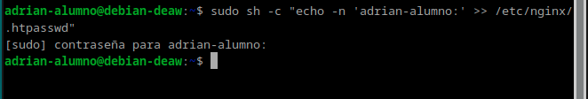

Y después, crearemos una contraseña que cifrará al usuario.

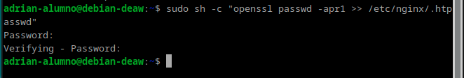

### TAREA .- 

Crear dos usuarios, uno con tu nombre y otro con tu primer apellido.

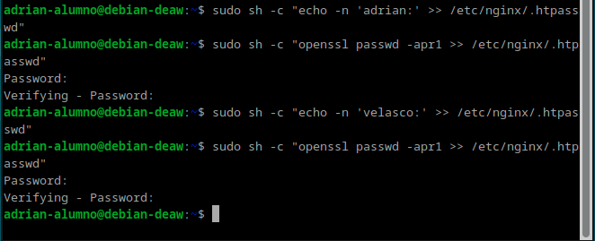

Comprueba que el usuario y la contraseña aparecen cifrados en el fichero .htpasswd

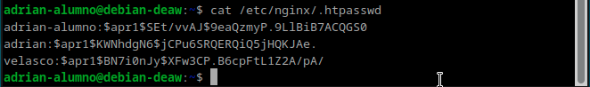

### Configurando el servidor Nginx para usar autenticación básica.

Debemos de editar nuestro archivo de configuración para añadir la configuración para que nginx utilice el fichero que previamente hemos creado y podamos así usarlo en nuestra página para que pida el acceso de usuario.

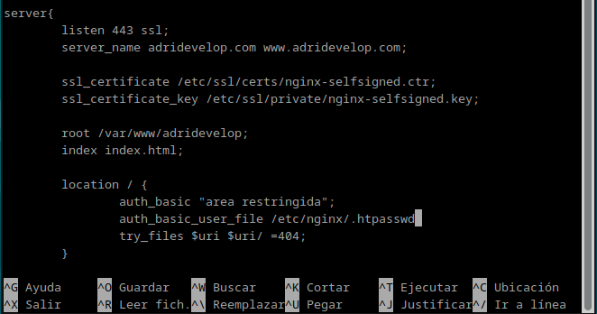

Y una vez finalicemos, reiniciaremos nuestro servicio nginx.

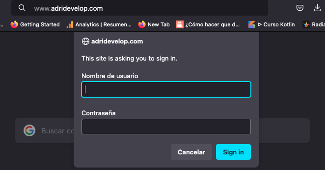

### Probando la nueva configuración.

### TAREA.-

Intentamos iniciar con un usuario.
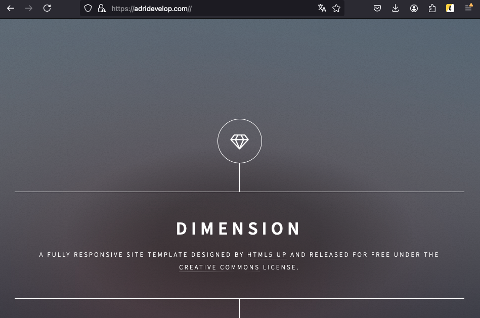

### TAREA.- 

Borra las dos líneas que hacen referencia a la autenticación básica en el location del directorio raíz. Tras ello, añade el nuevo location dentro con la autenticación básica para el archivo/sección contact.html únicamente.

Para ello, como no podemos hacer uso de #contact debemos de crearnos un contact.html a parte con el contenido de #contact en nuestro directorio del proyecto para que podamos hacer referencia a él desde el archivo de configuración. 
Una vez lo tengamos creado, con todo el contenido, debemos de añadir la configuración para que nuestro sistema pida la autenticación de usuario cuando se quiera acceder a esa página y no nos dejará acceder nada más que a contact.

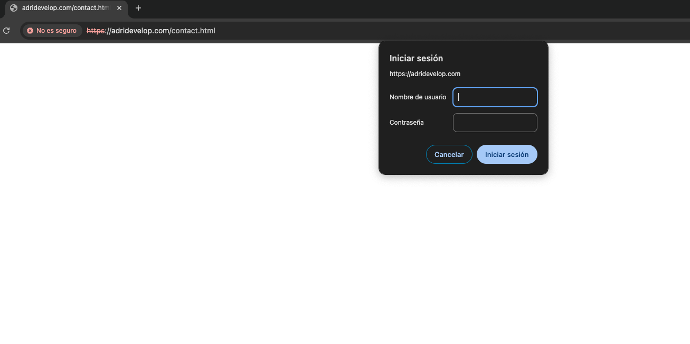

### Comprobación de autenticación básica con la restricción de acceso por IP.

En este paso, permitiremos y denegaremos el acceso a la ip de nuestra máquina. Para ello debemos de añadir en nuestro archivo de configuración
lo siguiente.

### TAREA.-

Configura Nginx para que no deje acceder con la IP de la máquina anfitriona al directorio raíz de una de tus dos webs. Comprueba que se deniega el acceso:

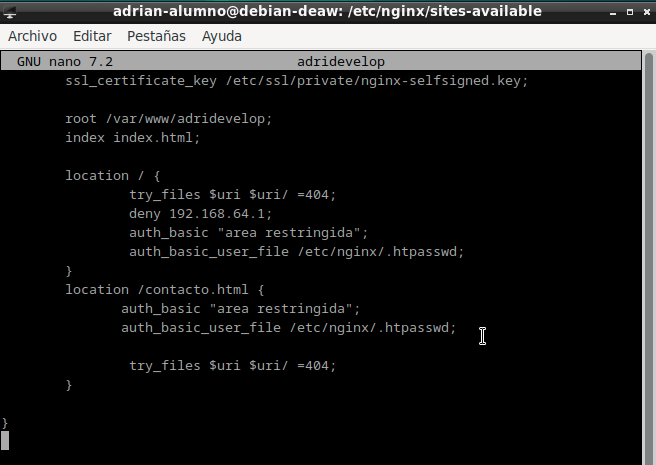

Muestra página de error en el navegador.

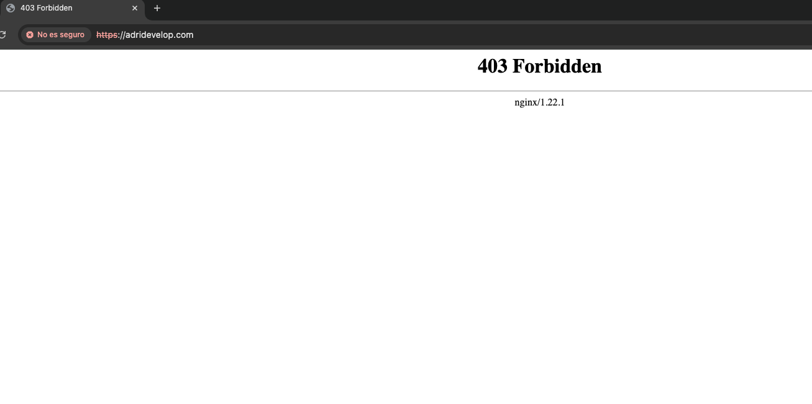

Muestra el mensaje de error de error.log.

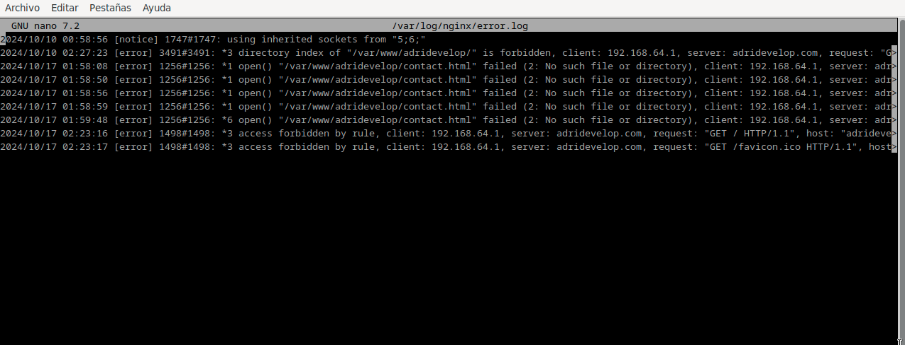

### TAREA.- 

Configura Nginx para que desde tu máquina anfitriona se tenga que tener tanto una IP válida como un usuario válido, ambas cosas a la vez, y comprueba que si puede acceder sin problemas.

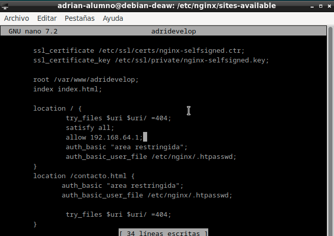

