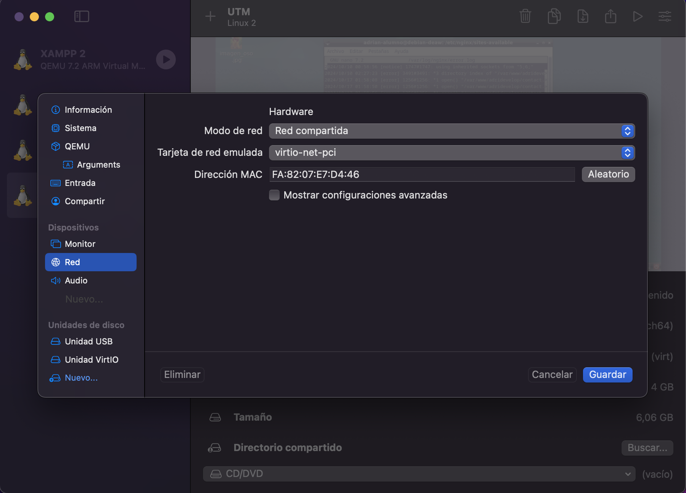
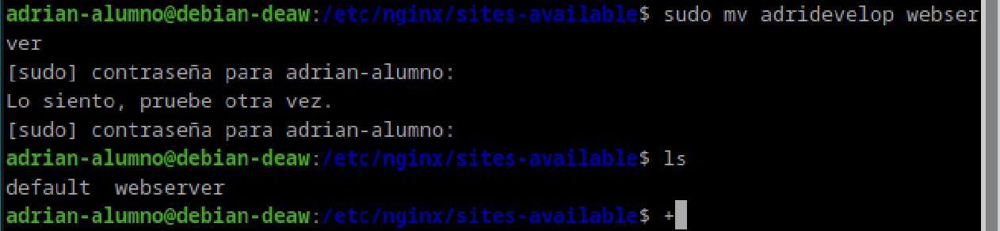
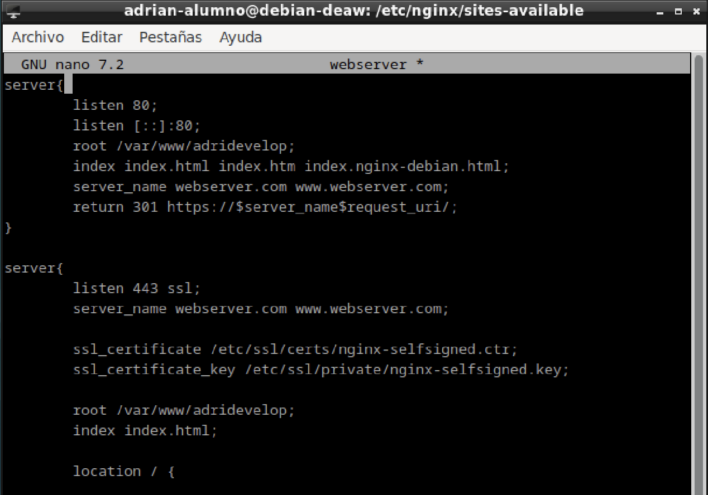
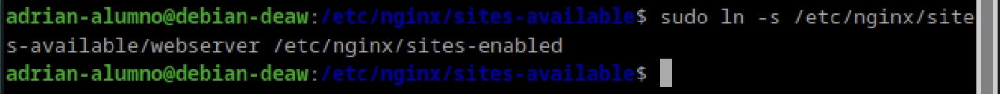
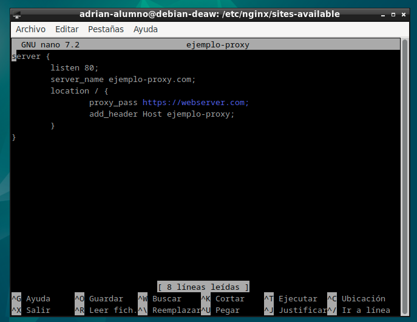
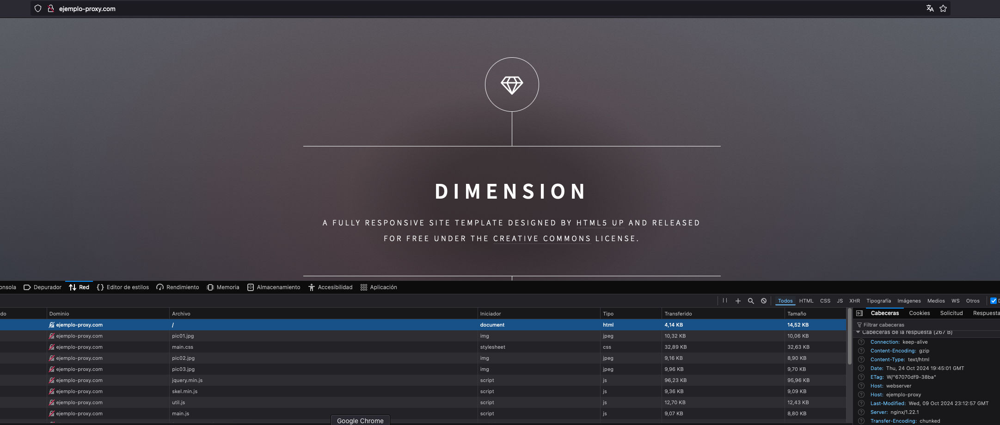

## Practica 2.3: Proxy inverso con Nginx.

Para esta practica, deberemos de clonar antes de nada nuestra maquina principal para crear la proxy, teniendo la precaucion de que al clonarla, tenemos que cambiarle la direccion mac a esa maquina para que no haya conflictos en la red ya que tendrian la misma ip.



Una vez hecho esto, deberemos de irnos a nuestro proxy y cambiar el nombre que tuvieramos de nuestra web por el de webserver en todas las coincidencias, tanto nombre de archivo como en la configuracion.

Tambien deberemnos de agregar en el archivo hosts de nuestro proxy y de nuestra maquina virtual las ip de nuestro webserver y de nuestro proxy.





Y tras esto deberemos de eliminar el enlace simbolico que habia con nuestro archivo y hacerlo con el nuevo.




Ya terminado con esto, procederemos ahora a reiniciar el servicio de nginx.

### Nginx proxy inverso

Deberemos de crearnos en nuestro proxy inverso un archivo con el nombre ejemplo-proxy. Este archivo tendra lo siguiente:



Deberemos de hacer las comprobaciones añadiendo las cabeceras para que, cuando nuestro proxy escuche y redireccione a webserver, se manden las dos cabeceras, la del proxy y la del webserver.

Para ello, deberemos de añadir la siguiente linea a nuestro archivo de configuracion.

```add_header Host nombre_del_host;```

Obviamente, cuando hagamos esto, deberemos de reiniciar nuestro servicio de nginx. Y una vez reiniciado, realizaremos las comprobaciones.



