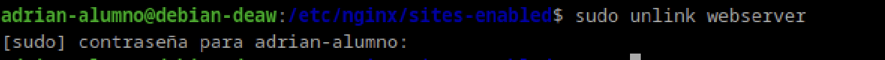
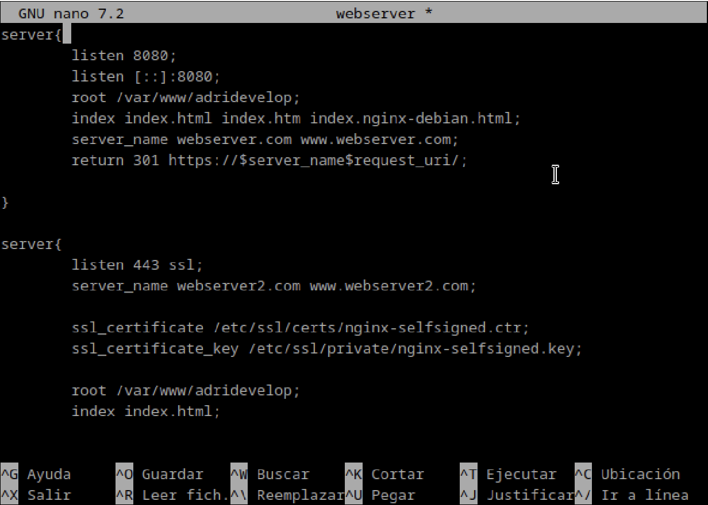
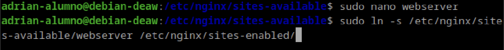
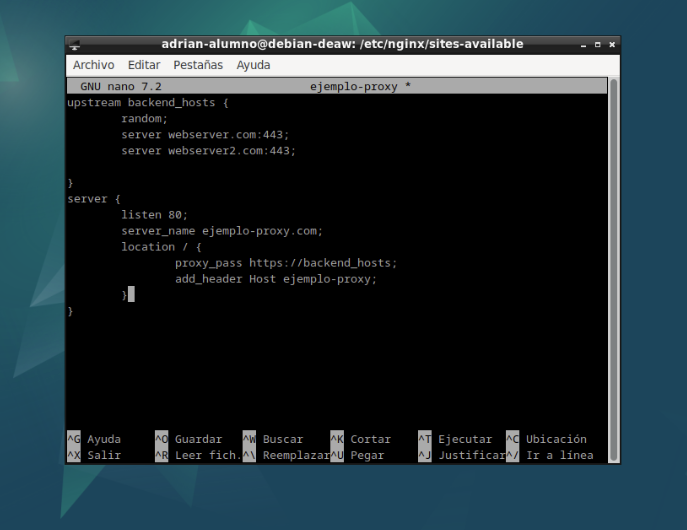
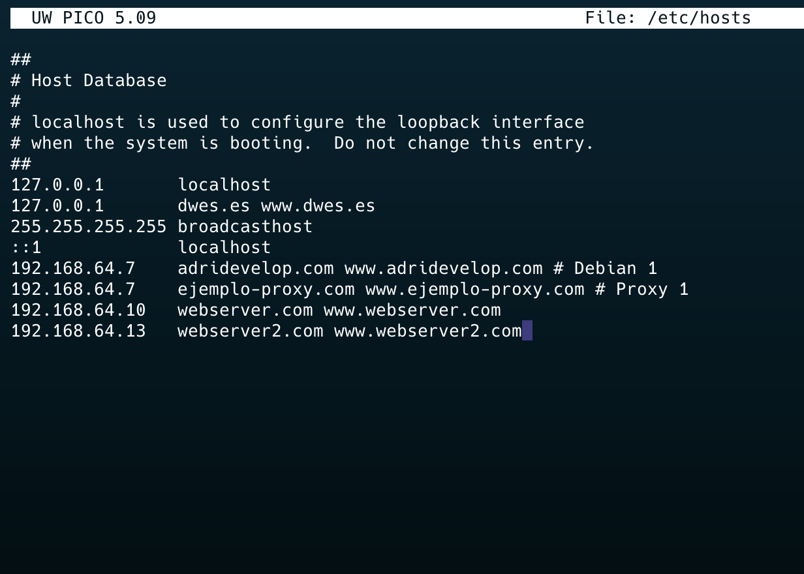
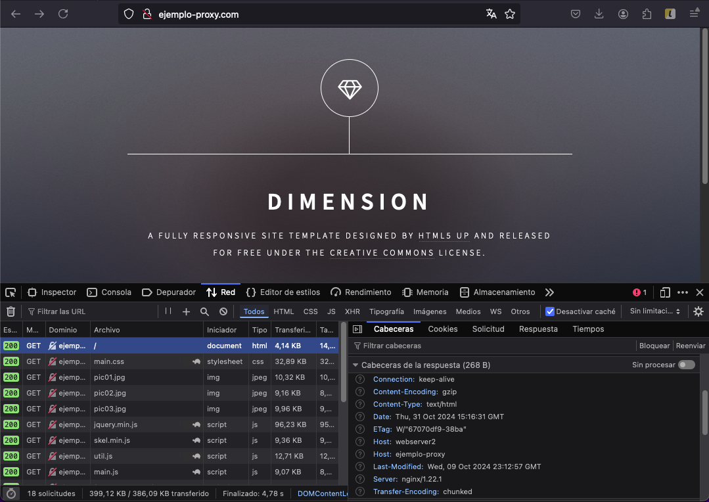
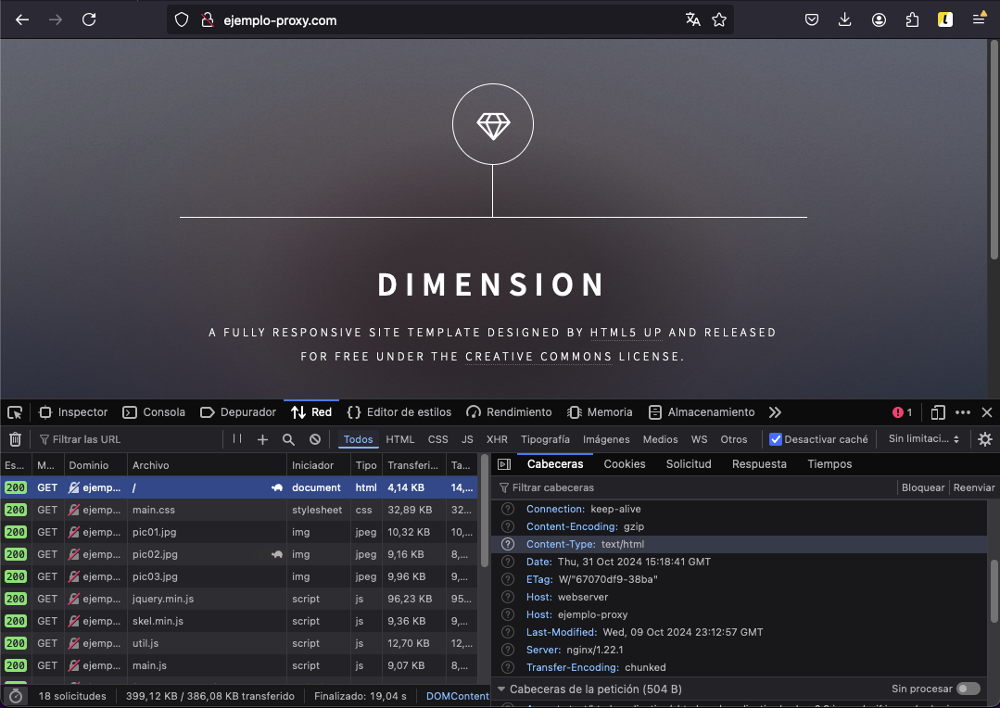

# Practica 2.4 - Balanceo de Carga con Proxy inverso Nginx.

Lo primero que deberemos de hacer sera crear nuestra copia de nuestra maquina virtual, teniendo asi 2 maquinas con servidores web distintos y un proxy reutilizado de la practica anterior. Este servira para que realice el balanceo de carga entre los dos servidores web.

# Configuracion del nuevo webserver2.

## Unlink webserver clonado.
Hacemos unlink del webserver que teniamos configurado de la maquina que ha sido clonada y configuramos el nuevo webserver.

## Ningx proxy inverso.
Tras esto, deberemos modificar tambien el archivo webserver, ya que la configuracion es de la maquina anterior.

## Nginx servidor webserver.
Deberemos de configurar la maquina proxy escuche a la maquina clonada (webserver2), como hicimos en la anterior practica con la maquina clonada(webserver1), y le agregaremos la cabecera para este webserver(webserver2) y se creara un bloque upstring que lo que hara sera englobar a los dos servidores webserver para que cuando haya sobrecarga, pueda redirigir a webserver1 o a webserver2.

## Configuracion archivo ejemplo-proxy de la maquina proxy.

## Configuracion archivo /etc/hosts de la maquina local.

## Comprobaciones.
Comprobamos que cuando la maquina webserver1 este caida(o apagada) o sobrecargada, se redirija a la maquina webserver2, comprobandolo mediante el header que envia la pagina.

Y despues hacemos lo correspondiente con la otra maquina.

