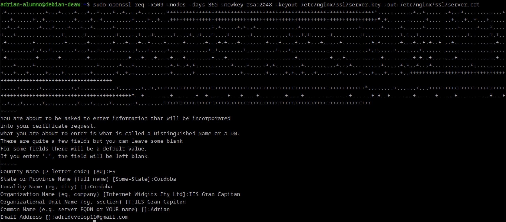
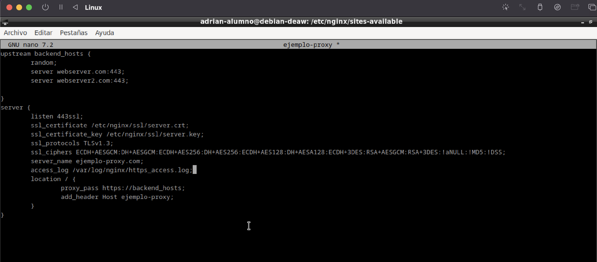
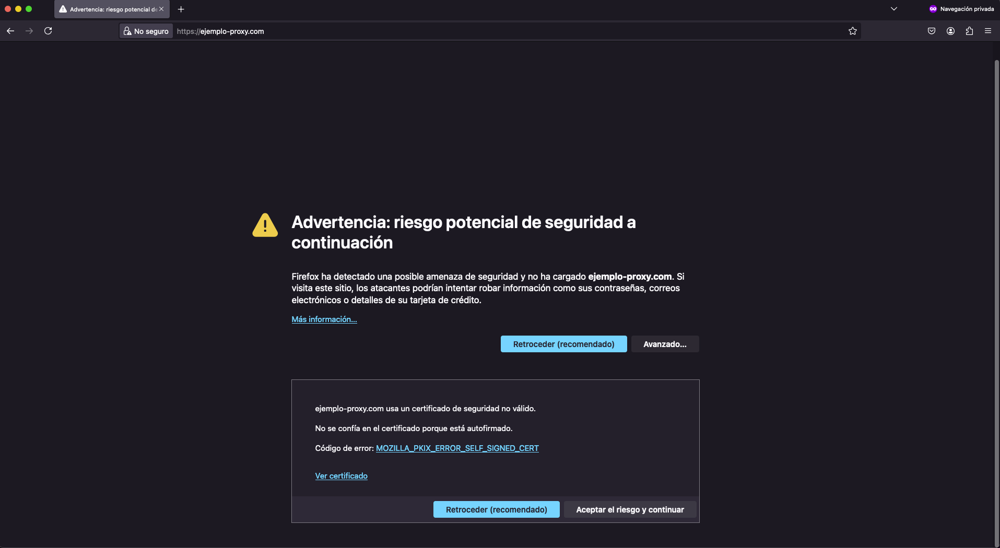
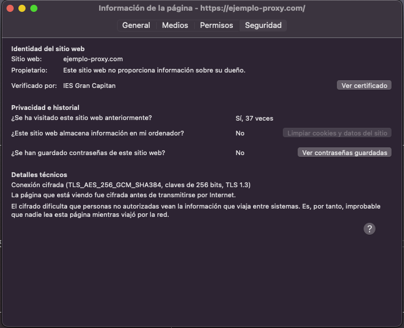
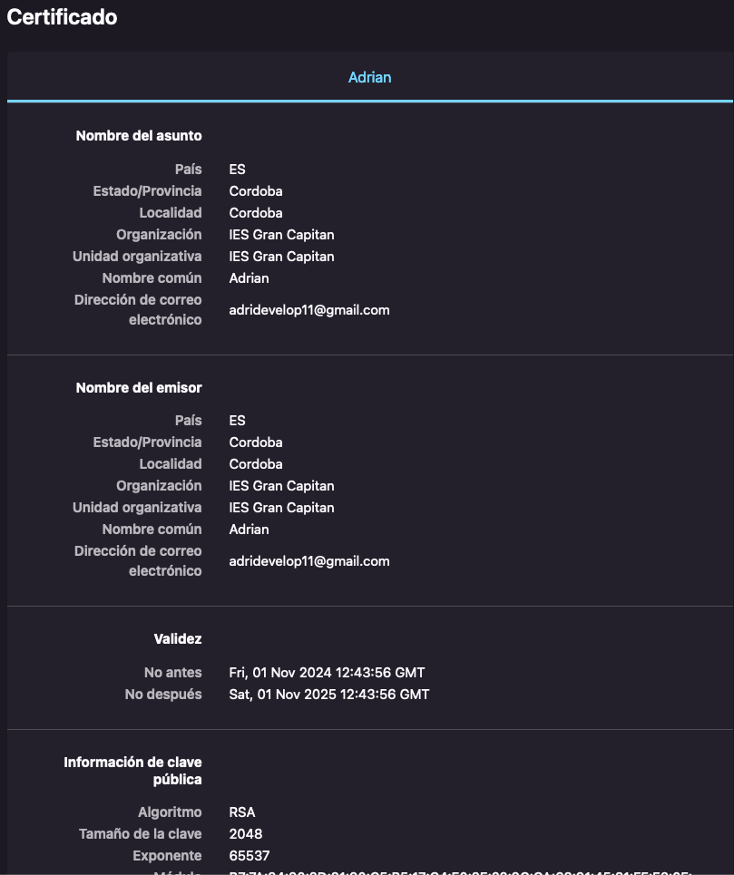
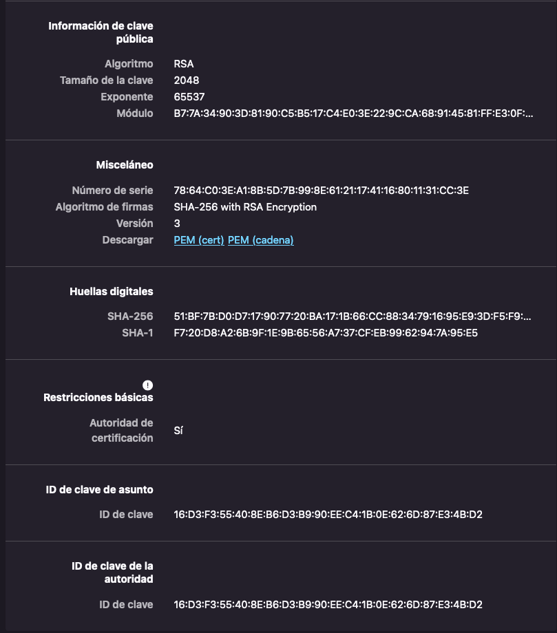

# Practica 2.5 - Proxy inverso y balanceo de carga con SSL en NGINX

En esta practica agregaremos la configuracion SSL para cifrado ssl en nuestro Proxy inverso.

## Creacion de nuestro certificado autofirmado.
Haremos uso de nuestro certificado autofirmado ya que como no tenemos desplegada nuestra web  y los certificados
son de pago, pues lo haremos de forma autofirmada.

Lo que deberiamos de hacer, para crear nuestros certificados seria:
  - Irnos a la maquina proxy.
  - Crear un directorio en el que guardaremos nuestros certificados.
  - Y crear los certificados.

### Como creamos el directorio para nuestros certificados?

### Como creamos nuestros certificados?
Deberemos de crear nuestro certificado de la siguiente forma, cambiando la direccion que yo uso para guardar los certificados por la que se vaya a usar en otro caso.

Tras agregar esa linea de comando nos pedira la configuracion para nuestro certificado. En la practica ponia una configuracion pero yo he agregado una personal en vez
de poner 2DAW.

## Configuracion del proxy inverso para aceptacion de certificados autofirmados.
Tras esto, ya tendiramos nuestras claves en el archivo indicado. Ahora, debemos de configurar nuestro proxy-inverso. Para ello deberemos de realizar lo siguiente:
  - Editar nuestro archivo proyxy-inverso.
  - Hacer un unlink de este en la carpeta sites-enabled.
  - Agregar la configuracion para que agregue la aceptacion de los certificados en el sites-enabled.

### Como debemos de editar nuestro archivo de proxy-inverso?

### Como hacemos el unlink de nuestro archivo proxy-inverso?
Mediante el comando sudo unlink nombre-ejemplo-proxy IMPORTANTE dentro de nuestra carpeta sites-enables ya que sino, se nos borraria la configuracion de nuestro proxy-inverso de la carpeta sites-availabe si hacemos el comando desde ese directorio.

### Como agregamos la nueva configuracion a sites-enabled?
Mediante el comando sudo ln -s /etc/nginx/sites-available/nombre-ejemplo-proxy /etc/nginx/sites-enabled

## Comprobaciones. 
Las comprobaciones las deberemos hacer desde un navegador externo, en el cual accederemos a nuestro ejemplo-proxy.com. Pero tenemos que tener una maquina webserver corriendo, sino, no nos redijira a ninguna parte.

Cuando estemos dentro, clickaremos en Aceptar el riesgo y continuar y nos aparecera la redireccion correctamente. Pero aqui lo importante es ver si los certificados estan correctamente asi que accederemos al candado que tenemos en la parte superior al lado de la barra de busqueda de nuestro navegador. 

Y nos aparecera esta configuracion. Deberemos de acceder a la parte de ver certificado y ahi, nos aparecera toda la configuracion junto con las claves.

