# Práctica 3.1: Instalación de Tomcat y Maven para el despliegue de una aplicación Java.

Esta práctica consiste en realizar la instalaciñon del servidor Tomcat en una máquina nueva. Así que, lo primero que haremos, será crear una máquina nueva de debian.

Una vez la tengamos, procederemos con la instalación de Tomcat.

### Instalación de Tomcat

Para comenzar con la práctica, nos hará falta tener java instalado. Para ello, ejecutaremos el siguiente comando:

```sudo apt install defaulr-jre```


Una vez instalado, instalaremos Tomcat.
```sudo apt install tomcat10 tomcat10-admin```


Y comprobaremos los puertos que tenemos disponibles mediante 

```ss -ltn```
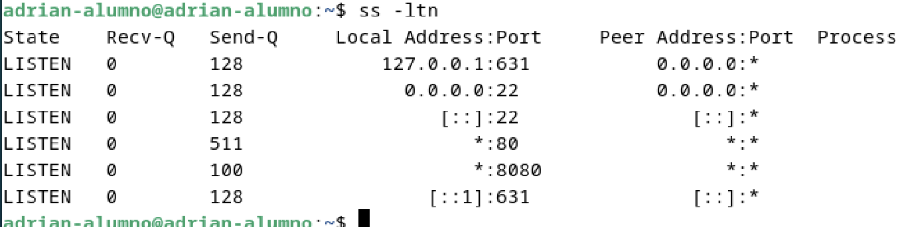

### Añadir usuarios a nuestro Tomcat.

Para poder manejar nuestro tomcat, deberemos de tener un usuario capaz de realizar las acciones. Para ello, vamos a crearnos un usuario desde el archivo donde se almacenan los usuarios de tomcat, editando el archivo de configuración.

```sudo nano /etc/tomcat10/tomcat-users.xml```


Una vez dentro, deberemos de añadir la siguiente línea de código en el archivo.


Reiniciamos nuestro servicio de Tomcat y comprobamos que se encuentre funcionando correctamente.

```sudo systemctl restart tomcat10```
```sudo systemctl status tomcat10```
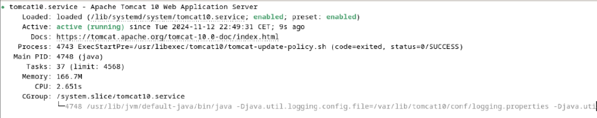

Y accedemos a localhost:8080/manager/html y comprobaremos que nos pide el logueo del usuario con el nombre de usuario y su contraseña.
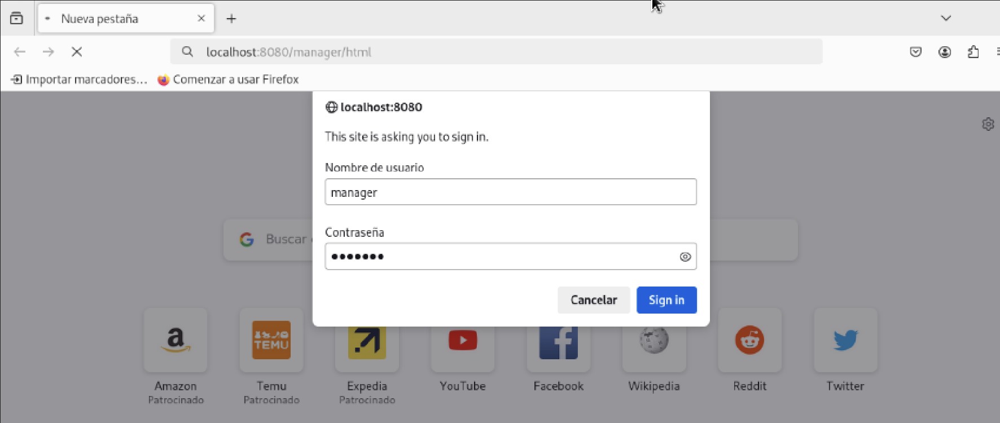

Y nos debería de aparecer la siguiente pantalla.

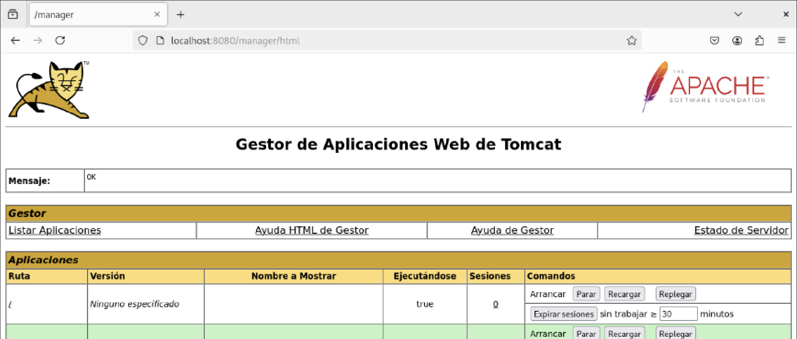

Con esto, ya tendríamos Tomcat funcionando correctamente en nuestra máquina. Podríamos comprobarlo accediendo al ejemplo que nos aparece en la página.

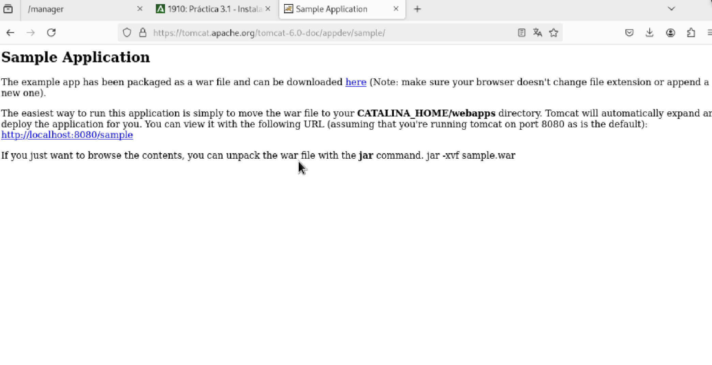

Si queremos trabajar con otro .war, deberemos de añadirlo. (El ejemplo de la documentación de moodle no funcionaba, aquí el error).

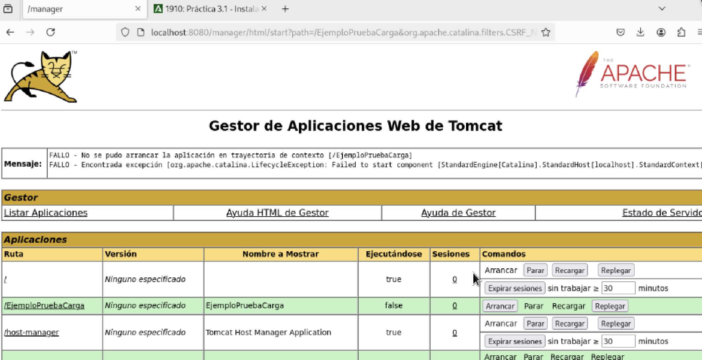

Entonces he decidido trabajaremos con otro .war que funcione correctamente el cual mostraré mas adelante en la práctica. Ahora procederé con la instalación de maven.

### Instalación de Maven
Deberemos de instalar maven para hacer los despliegues.
Para ello haremos uso del siguiente comando.

```sudo apt install maven```


Comprobaremos que se ha instalado correcramente mediante el comando

```mvn --v```
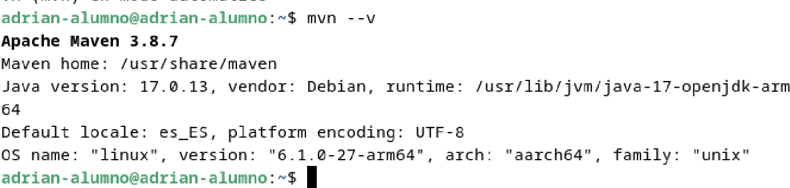

Ahora deberemos de configurar un usuario para hacer uso de los scripts.


### Clonación del repositorio que haremos uso.
Ahora, como dije anteriormente, haremos uso de un .war externo. Para ello haremos la clonación del repositorio del que haremos uso.


Antes de hacer el despliegue, deberemos de configurar el despliegue desde el pom.xml para que contenga la ruta a la que queremos desplegar la aplicación.

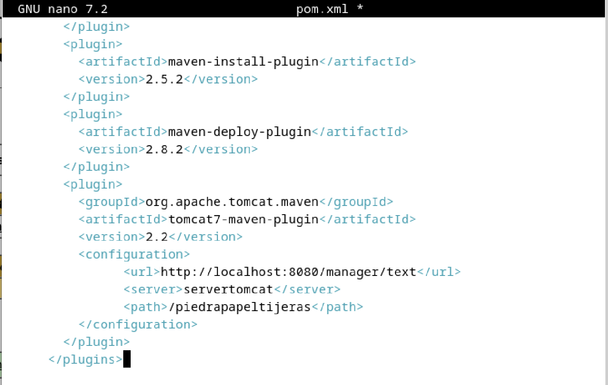

Una vez configurado, accedemos dentro de la carpeta del directorio que hemos clonado y ejecutamos el comando

```mvn tomcat7:deploy```


Y nos deberá de mostrar la siguiente salida de que se ha realizado correctamente.

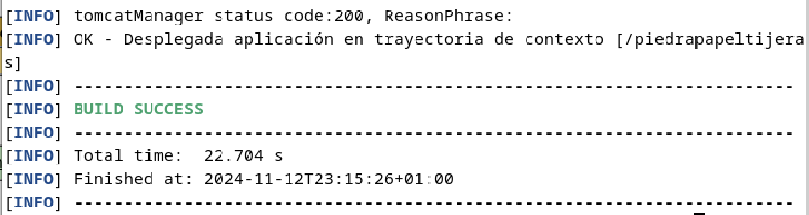

Y si accedemos a la página de localhost:8080/manager/html, deberemos de ver la aplicación desplegada.

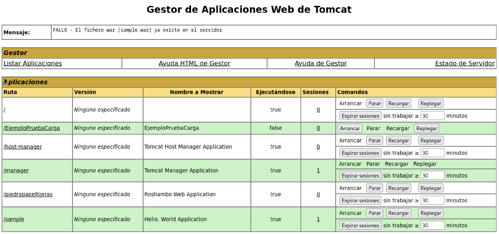

Y ahí la tendríamos con nombre pipedrapapeltijeras que fue la ruta que especificamos cuando modificamos nuestro pom.xml.

Ahora accederemos y haremos unas pruebas. Básicamente es un piedra papel o tijeras en el que nosotros cogemos una opción y la máquina coge otra y devuelve si ganas o pierdes y un contador.

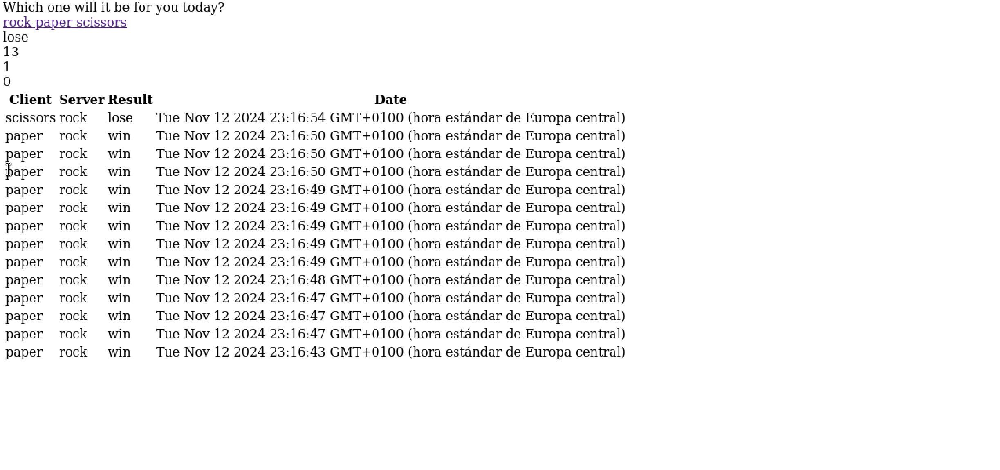


