# Práctica 4-1 Configuración de un servidor DNS

Para esta práctica, necesitaremos instalar ubuntu server en una nueva máquina virtual. Una vez la tengamos, procederemos con la práctica.

## 1.- Instalación de servidor DNS
Lo primero que deberemos de hacer, será instalar el servidor DNS usando el siguiente comando:
```sudo apt-get install bind9 bind9utils bind9-doc```

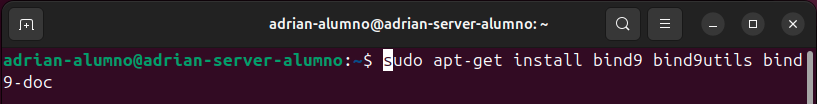

## 2.- Configuración del servidor DNS
Ahora, deberemos de editar el archivo de configuración de bind para que se usar IPv4.
Asi que lo primero que deberemos de hacer será:```sudo nano /etc/default/named```

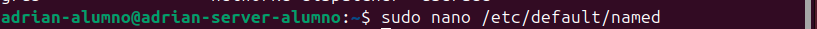

Y le añadiremos a ```OPTIONS``` el valor de ```-u bind -4```

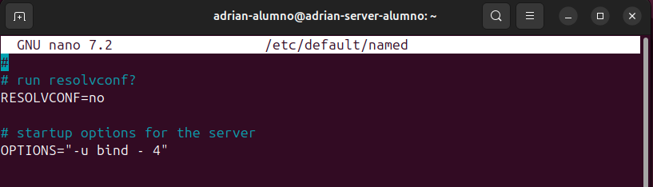

## 3.- Configuración del archivo named.conf.options
Como buena práctica procederemos a hacer una copia de seguridad del archivo que tenemos creado para que, en el caso de que haya algún problema, tengamos un backup en el que apoyarnos.

Para ello vamos a introducir el siguiente comando en nuestra terminal: ```sudo cp /etc/bind/named.conf.options /etc/bind/named.conf.options.backup```

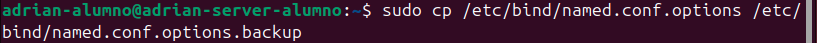

Una vez ya realizado nuestro backup, prosigamos con la práctica. Ahora, vamos a proceder a editar el archivo ```named.conf.options``` con el siguiente comando: ```sudo nano /etc/bind/named.conf.options```

Lo que realizaremos en el archivo será limitar el acceso a peticiones recursivas al servidor a aquellos host que nosotros queramos.

Para ello, agregaremos la siguiente línea al archivo:
```acl confiables { 192.168.X.0/24 };```. 

Y tras forwarders deberemos agregar: 
```allow-recursion { confiables; };```
```allow-transfer { none; };```
```listen-on port 53{192.168.64.21;};```
```recursion yes;```

Y comentaremos listen-on-v6.

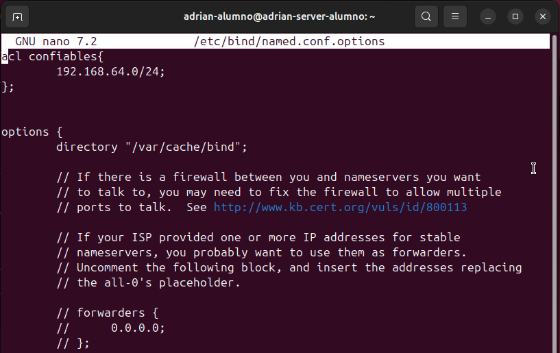
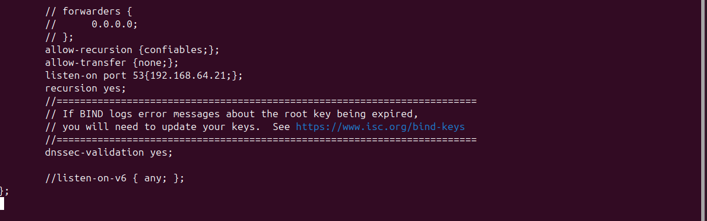

Y comprobaremos si la configuración introducida es correcta con el siguiente comando: ```sudo named-checkconf```

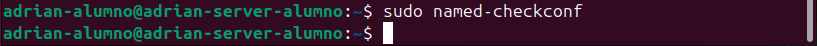

Y realizamos un restart y comprobamos el servicio:

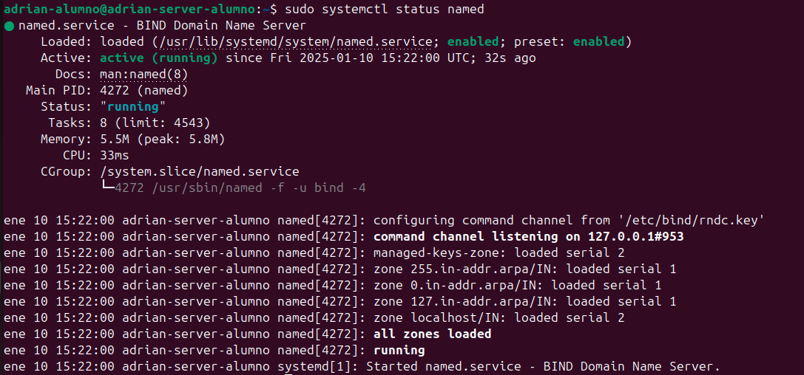

## 4.- Configuración del archivo named.conf.local
Ahora, deberemos de declarar nuestra zona ```deaw.es```.

Así que realizaremos un ```sudo nano /etc/bind/named.conf.local``` y añadiremos lo siguiente: ```zone "deaw.es" {type master;file "/etc/bind/db.deaw.es";};```

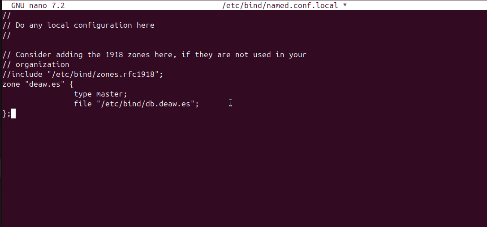

## 5.- Configuración del archivo db.deaw.es
Ahora, deberemos de crear el archivo ```db.deaw.es``` en la ruta ```/etc/bind/```.

Y añadirle lo siguiente:
```$TTL 604800
@                       IN                              SOA                     debian.deaw.es. admin.deaw.es. (
                                                                                2022112001 ;Serial
                                                                                3306       ;Refresh
                                                                                1800       ;Retry
                                                                                604800     ;Expire
                                                                                86400      ;Minimun TTL
                        )

                        IN NS debian.deaw.es.

debian IN A 192.168.64.21
```

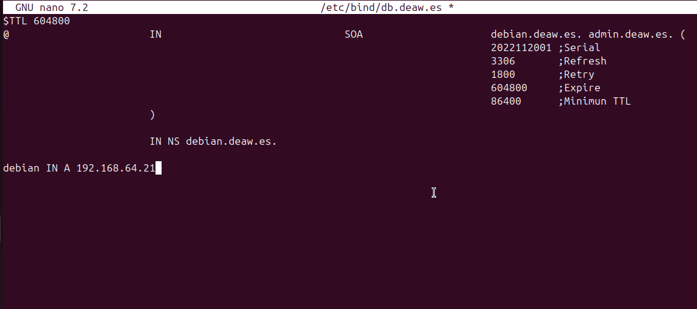

## 6.- Creación del archivo de zona para la resolución inversa
En este paso, en el archivo named.conf.local, deberemos de ingresar las zonas al igual que hicimos con la resolución directa y tras esto, crearemos un nuevo archivo para la resolución inversa.

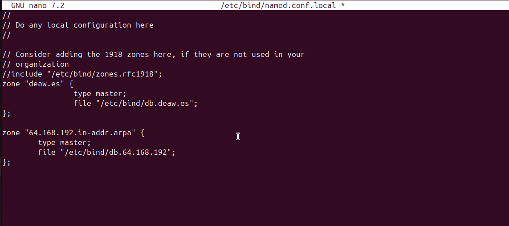

Creación del archivo de la configuración de la zona inversa:
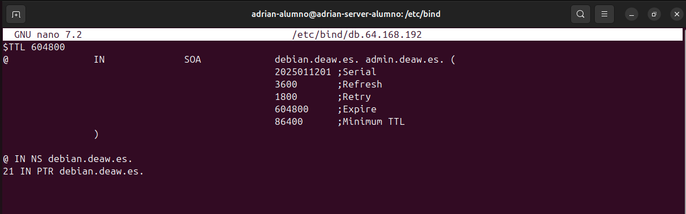

Y deberemos de cambiar nuestro documento resolv.conf del servidor para que se vea con su ip
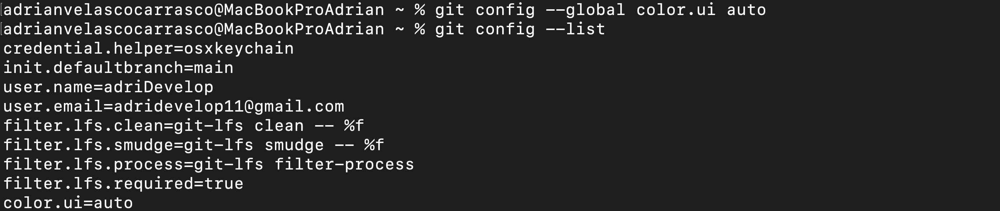

Y cambiar en el cliente tambien el resolv.conf
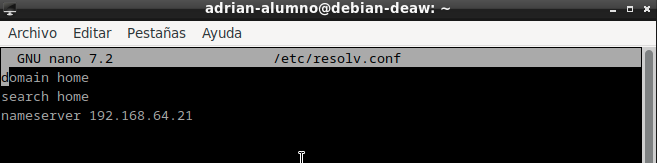

## 7.- Comprobación de la configuración
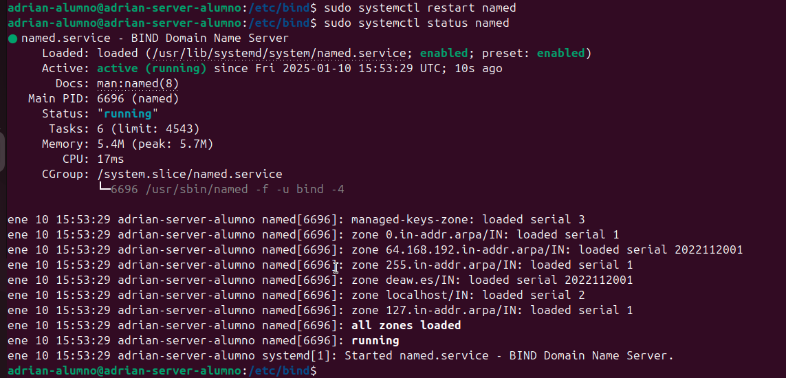

## 8.- Comprobación del funcionamiento
Iremos al cliente y haremos las siguientes comprobaciones:

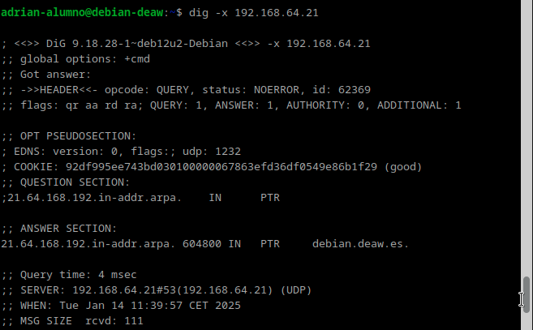

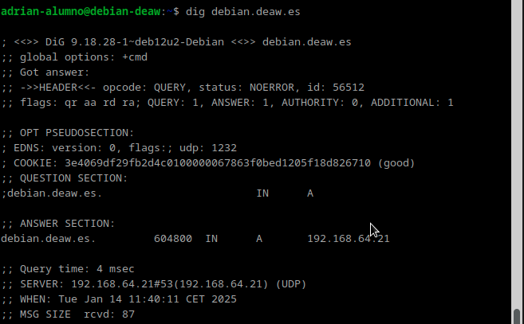

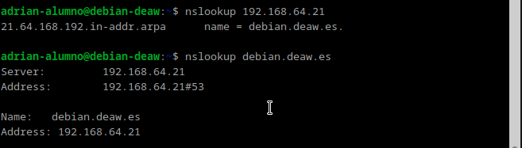


