# Práctica 5  .- Ejercicios Github

## Primera parte .- Repositorio DEAW
Lo primero que debemos de hacer es crear el repositorio DEAW si aún no lo tenemos creado:
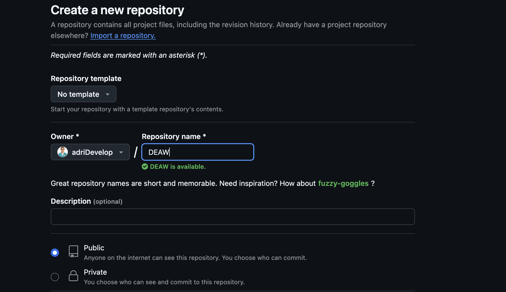

Seguimos clonandolo en nuestro repositorio local de la siguiente manera:
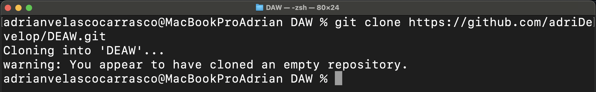

## Segunda parte .- README
Ahora, debemos de generar el README para nuestro repositorio. Para ello haremos lo siguiente:


Seguiremos, haciendo un ```git add README.md``` para que podamos hacerle el commit al archivo y despues realizar el push del mismo.


## Tercera parte .- Commit al archivo README.md
Y hacemos un commit del archivo.
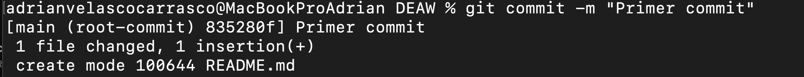

## Cuarta parte .- Push del archivo README.md
Y finalmente el push.
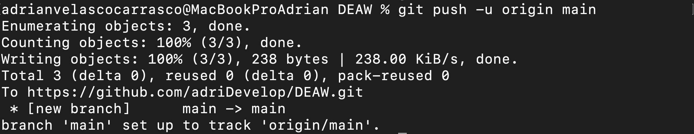

## Quinta parte .- Ignoración de archivos mediante el archivo ".gitignore"
Lo primero que debemos hacer en este paso es generar un fichero ```privado.txt```

Tras la creación de este archivo, generaremos el directorio ```/privada```


Y para que no los tenga en cuenta git, debemos de generar un archivo .gitignore para que ignore tanto el archivo ```privado.txt``` y el directorio ```/privada```
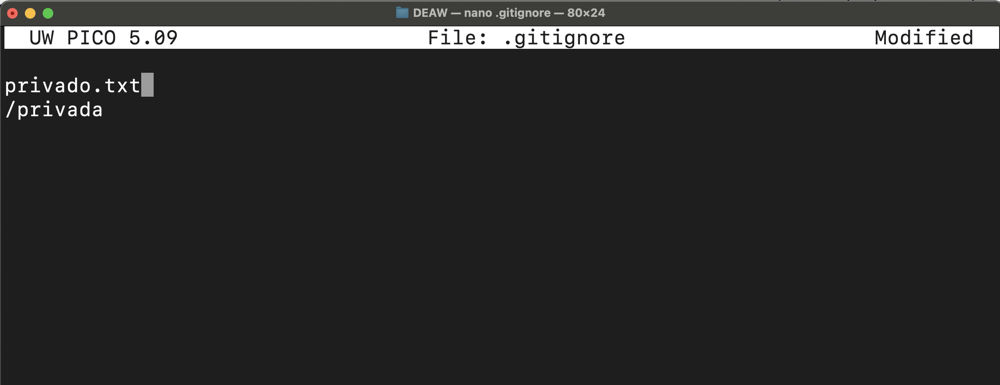

## Sexta parte .- Crear el fichero 1.txt y agregarlo al repositorio local
Se creará y agregará de la siguente manera:
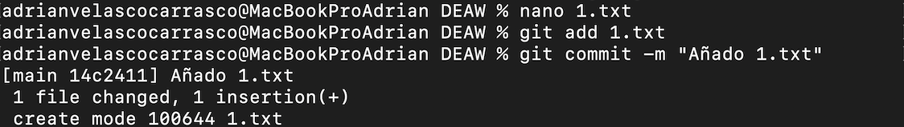

## Séptima parte .- Crear el tag v0.1
Lo creamos usando el comando ```git tag```


## Octava parte .- Subir el tag v0.1
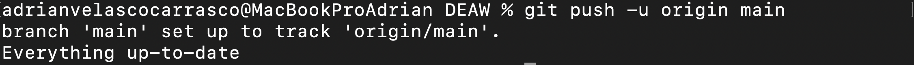

## Novena parte .- Cuenta de github
Deberemos de agregarle a la cuenta de github una foto (si no la tenemos agregada ya)
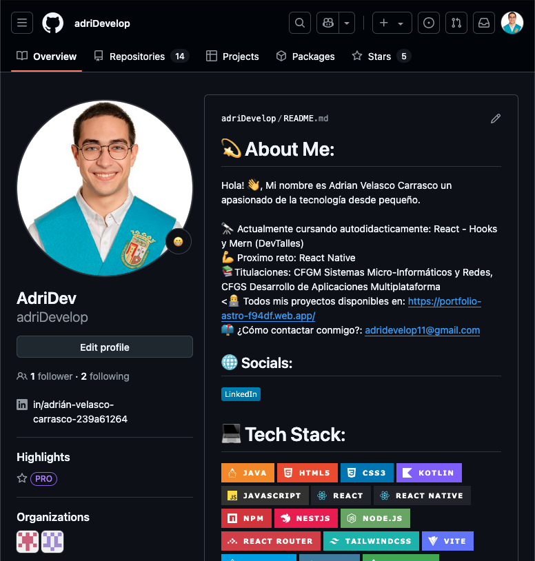

También, activar la protección doble factor en la cuenta de github, para ello:

1.- Deberemos de irnos a la configuración de nuestro perfil y encontrar " Two-factor authentication"
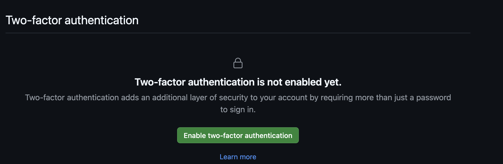

2.- Tras eso, deberemos de seguir los pasos que nos diga la web. El primero es descargarnos la app móvil y darle permiso desde el teléfono.
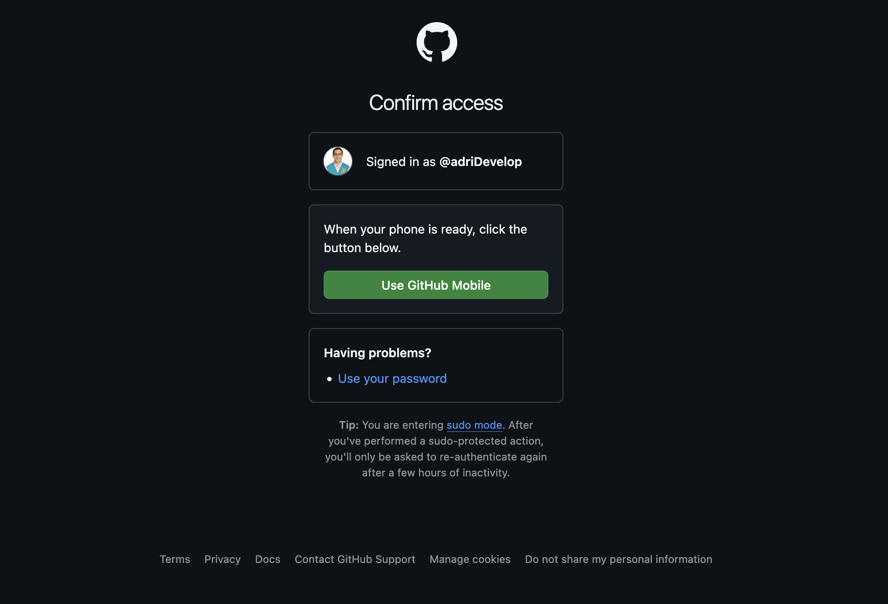

3.- El siguiente paso sería escanear un QR en el que agregaremos a nuestro teléfono el ```Two-factor authentication``` y nos dará un código cada vez que queramos acceder a nuestra cuenta. (no pongo captura por seguridad)

4.- El siguiente paso, nos mostrará una serie de códigos de recuperacion que deberemos de guardar en un lugar seguro. Descargaremos y proseguimos.

5.- Ya estaríai activado la protección doble factor en nuestra cuenta de github.
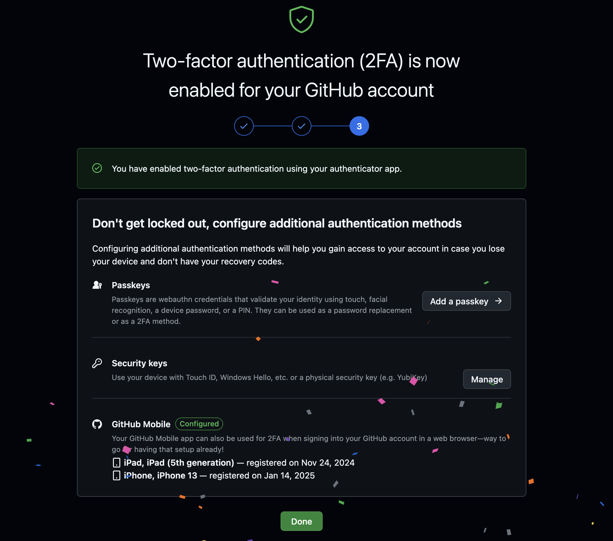

## Décima parte .- Uso social de Github
Deberemos de seguir a dos compañeros de clase en su cuenta de github
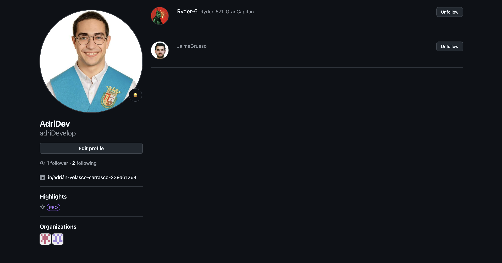

Cuando lo tengamos, deberemos de seguir los repositorios de nuestros compañeros y hacerle un star
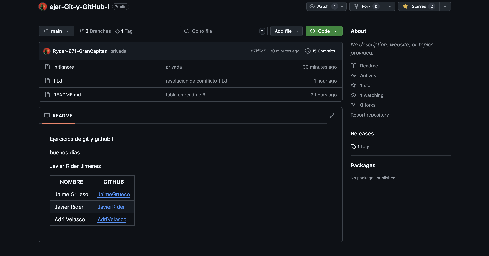

## Undécima parte .- Crear una tabla mencionando a nuestros compañeros
Para ello, en nuestro README.md, crearemos una tabla en la que mostraremos el nombre y un enlace para poder ir a su repositorio.
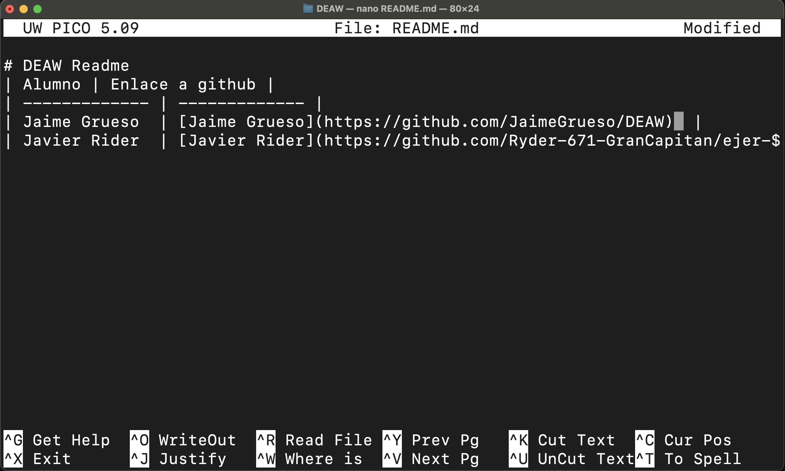

## Duodécima parte .- Creación de una rama
A continuación, deberemos de crearnos una rama con nombre v0.2 y posicionarnos en ella.
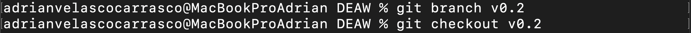

## Decimotercera parte .- Añadir un fichero a la rama v0.2
Ahora, deberemos de crear un fichero ```2.txt``` y lo añadiremos a la rama v0.2
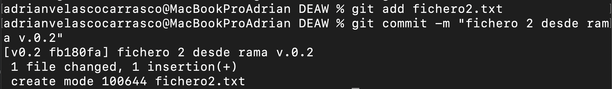

## Decimocuarta parte .- Merge directo
Ahora, deberemos de posicionarnos en la rama master y realizaremos un merge de la rama v0.2 en la rama master, para ello vamos a usar los siguientes comandos:

1.- Para posicionarnos en la master (que lo tengo nombrado main)
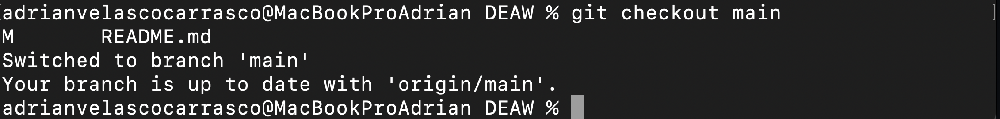

2.- Para hacer el merge de la rama v0.2 en la rama master
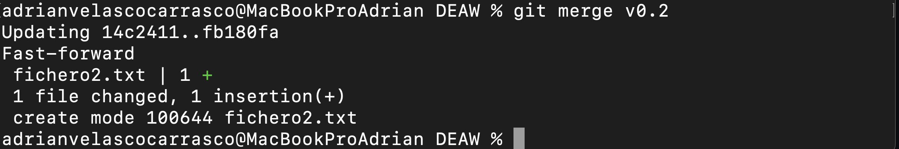

## Decimoquinta parte .- Merge con conflicto
Seguiremos ahora generando un conflicto entre las ramas.

Para ello, deberemos de hacer lo siguiente:

1.- En la rama master, editaremos el fichero ```1.txt``` y haremos un commit.
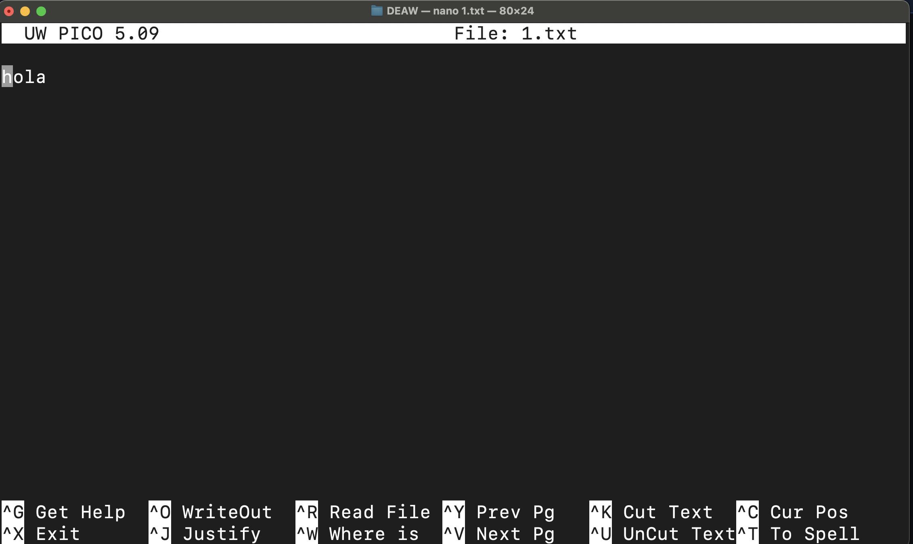

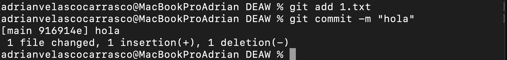

2.- En la rama v0.2 editaremos el fichero ```1.txt``` y haremos el commit.
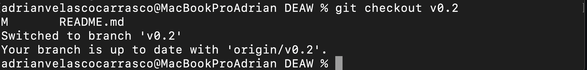


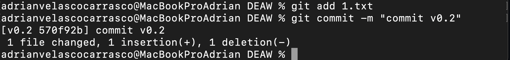

3.- Ahora, nos posicionaremos en la rama master y haremos un merge con la rama v0.2.
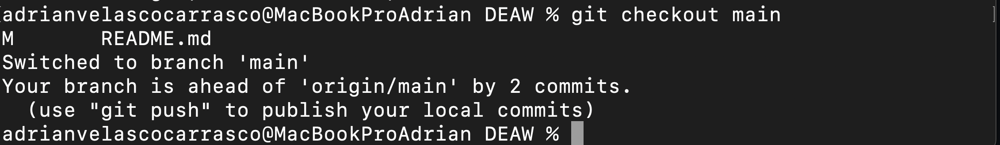

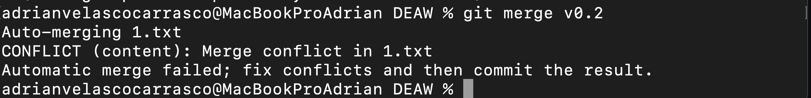

## Decimosexta parte .- Listado de ramas
Ahora, listaremos las ramas con merge y sin merge. Para ello, usaremos lo siguiente:
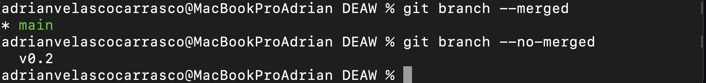

## Decimoséptima parte .- Arreglar conflicto
Ahora, para arreglar el conflicto, deberemos de editar el archivo de texto ```1.txt``` y una vez editado, haremos un commit y un push.
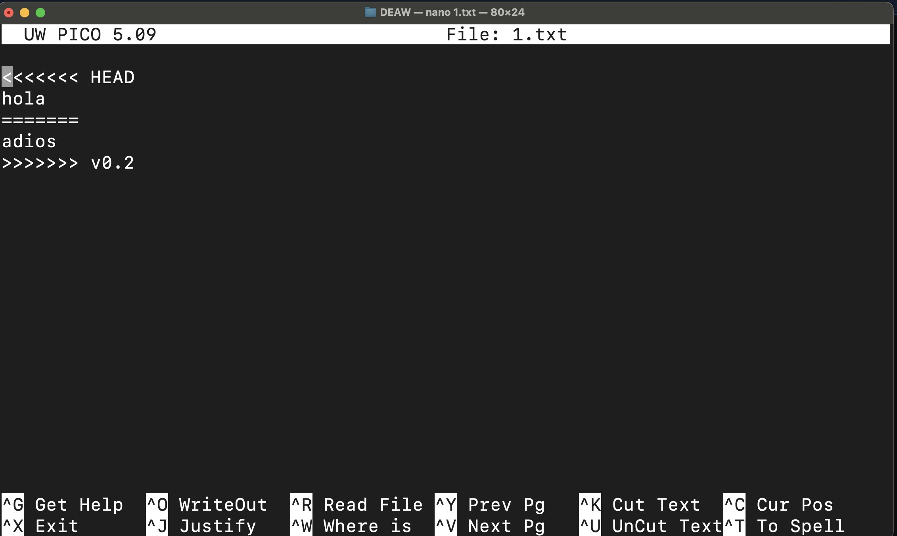

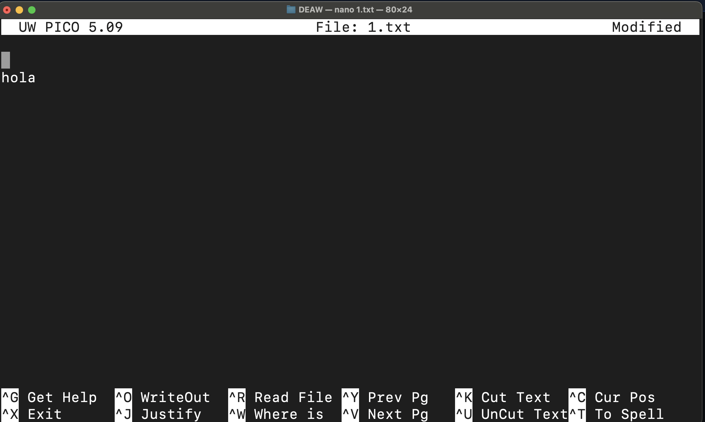

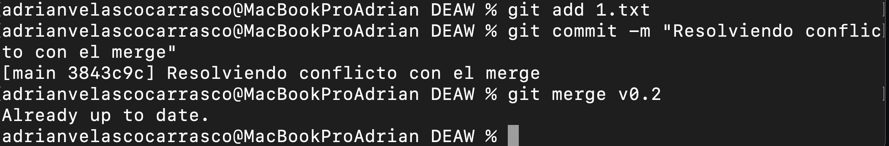

## Decimoctava parte .- Borrar rama
Seguido de esto, procederemos a borrar la rama v0.2
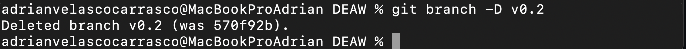

## Decimonovena parte .- Listado de cambios
Y para finalizar, realizaremos un listado de los distintos commits con sus ramas y sus tags
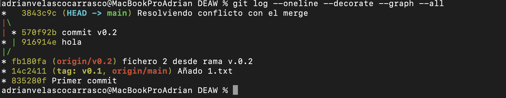


