# Práctica 6.1.- Dockerización del despliegue de una Aplicación con Node.js

## Despliegue con Docker
Lo primero que deberemos de hacer es instalar Docker en nuestro sistema.
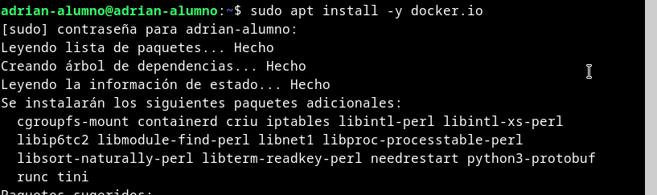

Tras esto, el siguiente paso que deberemos de realizar será el clonar el repositoprio de GitHub [https://github.com/raul-profesor/DAW_practica_6.1_2024.git](https://github.com/raul-profesor/DAW_practica_6.1_2024.git)
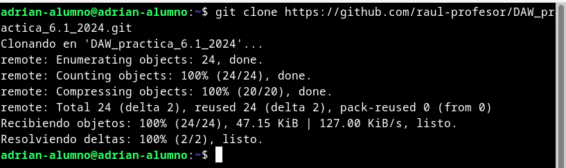

Cuando tengamos el repositorio clonado, deberemos modificar el Dockerfile que vendrá con algunos datos en blanco que deberemos de rellenar de la siguiente manera
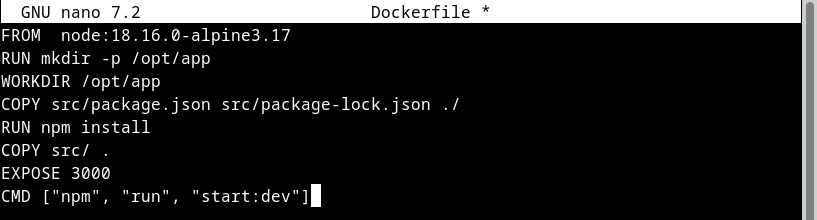

Una vez editado el archivo, deberemos de construir la imagen librodirecciones
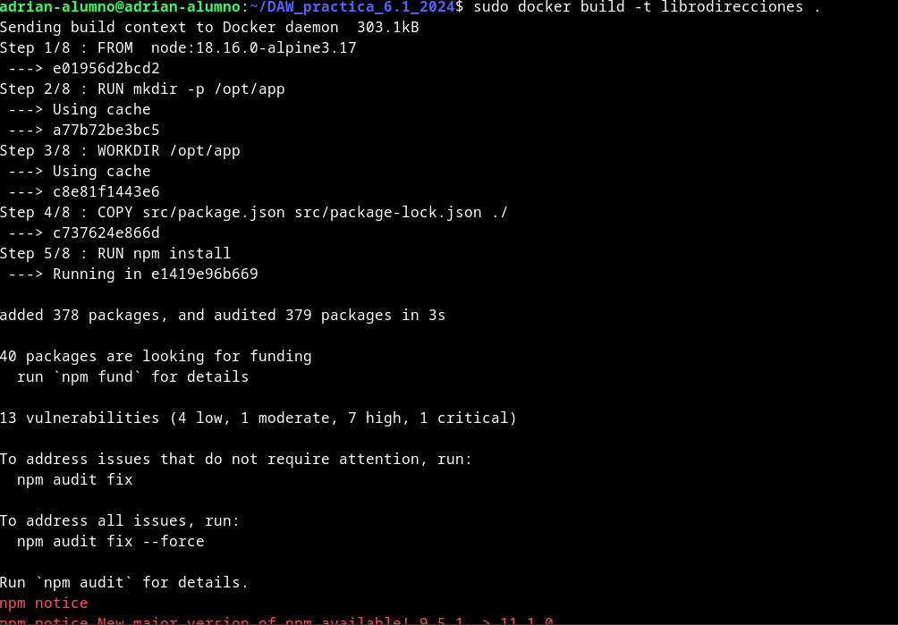
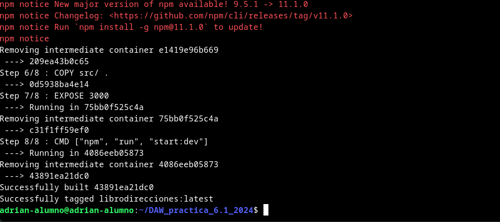

E iniciaremos el contenedor para que escuche peticiones en el puerto 3000 siguiendo este comando
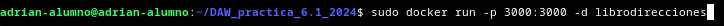

Y al probarlo, nos debería de salir la siguiente pestaña
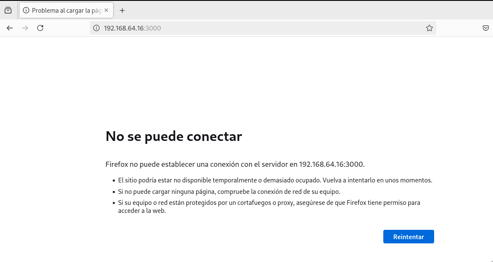

## Docker Compose
Para poder hacer uso de Docker Compose, deberemos de instalarlo en nuestro sistema.
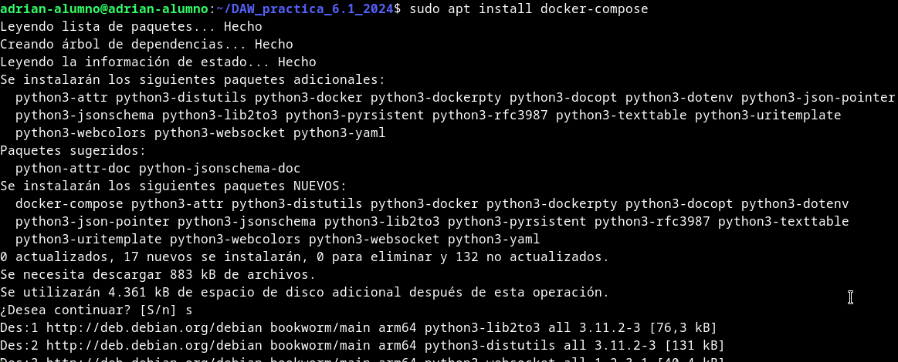

Comprobaremos la versión que se nos ha instalado de la siguiente manera
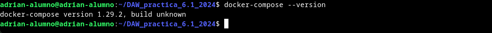

Ahora, deberemos de crear un archivo llamado docker-compose.yml en el que deberemos de añadir el siguiente contenido
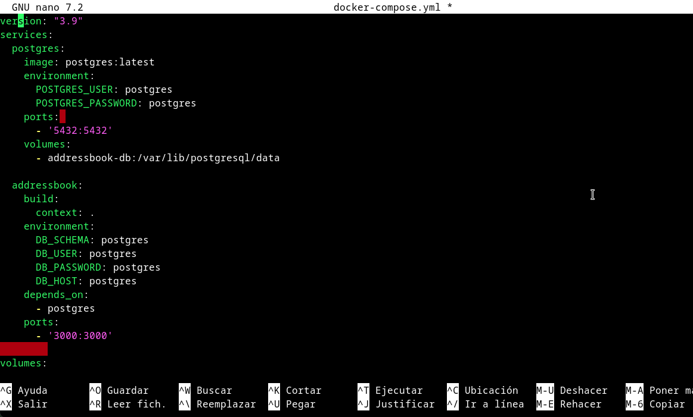

Una vez creado el archivo, debemos correr la imagen para que se creen todas las tablas que hemos definido en el archivo docker-compose.yml
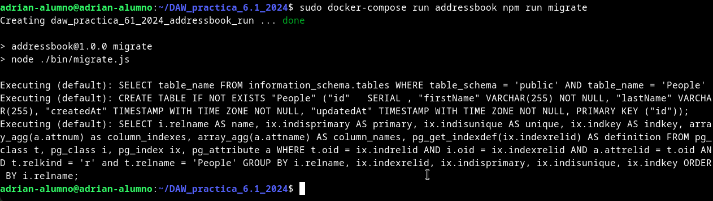

Una vez ejecutado el comando, deberemos de ejecutar el siguiente comando para que se inicie el contenedor
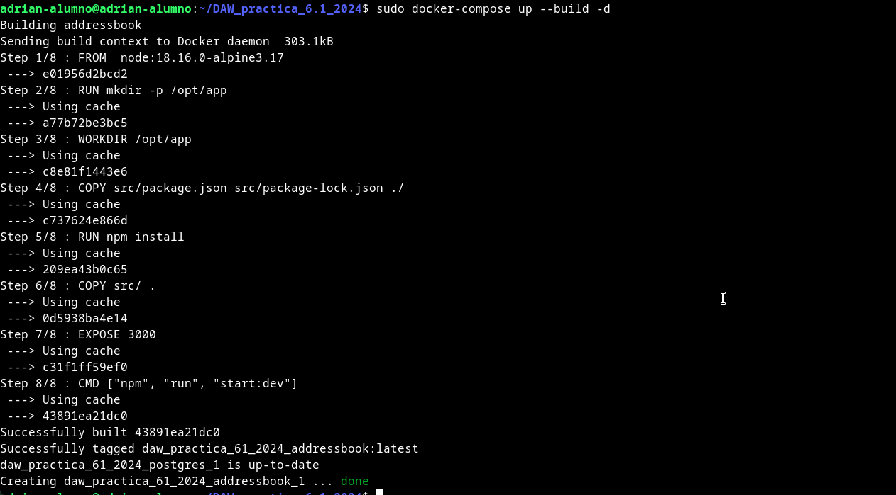

Y para probar que funciona correctamente, ejecutaremos lo siguiente
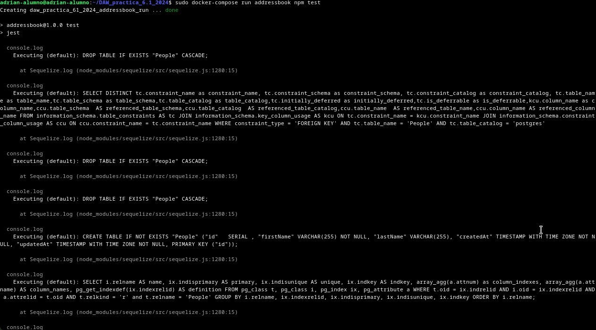
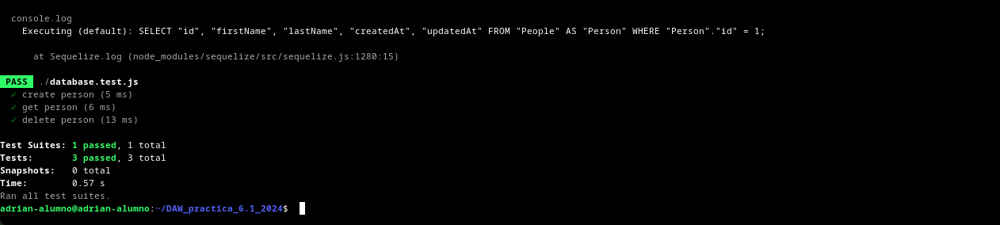

# Ejercicios

Añade una persona: ```curl -X PUT http://localhost:3000/persons -H'Content-Type: application/json' -d '{"id": 1, "firstName": "Raúl", "lastName": "Profesor"}```

Listar todas las personas: ```curl -X GET http://localhost:3000/persons/all -H 'Content-Type: application/json'```

Buscar una persona por ID: ```curl -X GET http://localhost:3000/persons/1 -H 'Content-Type: application/json'```

Eliminar una persona: ```curl -X DELETE http://localhost:3000/persons/1 -H 'Content-Type: application/json'```
