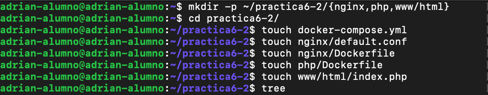
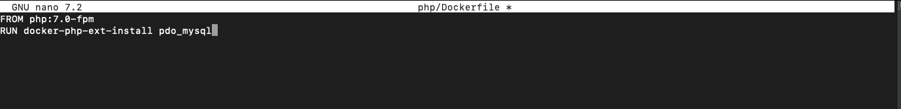

# Practica 6_2 .- Despliegue de una aplicación PHP con Nginx y MySQL usando Docker y docker-compose

## Lo primero que debemos de hacer es conectarnos mediante ssh a nuestro servidor desde nuestra terminal


## 2.- Estructura de directorios
Debemos de configurar la siguiente estructura de directorios 


Mediante estos comandos


## 3.- Crear archivo docker-compose con configuración de Nginx
Deberemos de crear nuestro archivo docker-compose.yml con la siguiente configuración para instalar la imagen de nginx


## 4.- Comprobación de funcionamiento de Nginx


## 5.- Creación del contenedor de PHP
Ahora, deberemos de editar el archivo index.php que se encuentra en www/html/index.php con el siguiente contenido


Tras esto, deberemos de configurar el archivo .conf de ./nginx/default.conf con el siguiente contenido


Una vez realizada la configuración, deberemos de editar nuestro Dockerfile de la misma direccion ./nginx/Dockerfile con el siguiente contenido


Y editaremos la configuración de nuestro docker-compose.yml con la siguiente configuración


Levantaremos de nuevo nuestro contenedor mediante el comando ```docker-compose up -d```


Y se deberá de ver lo siguiente


## 6.- Creación del contenedor para los datos
Deberemos de editar nuestro docker-compose.yml con el siguiente contenido


Y deberemos de levantar el contenedor mediante el comando ```docker-compose up -d```


## 7.- Creación del contenedor de MySQL
Antes de instalar nuestro contenedor MySQL, deberemos de editar nuestro Dockerfile situado en la ruta ./php/Dockerfile con la siguiente configuración


Después, deberemos de actualizar nuestro docker-compose.yml con lo siguiente


Y tambien, editaremos nuestro index.php situado en ./www/html/index.php con el siguiente contenido


Y deberemos de levantar nuestro contenedor mediante el comando ```docker-compose up -d```

Y se verá lo siguiente


## 8.- Comprobación de funcionamiento de la aplicación
Ahora, cambiaremos la configuración de nuestro archivo index.php situado en ./www/html/index.php con el siguiente contenido para que inicie con el usuario root y podamos ver las bases de datos


Levanta de nuevo el contenedor mediante el comando ```docker-compose up -d```

Y se deberá de ver lo siguiente
