# Páctica 6.3.- Servidor web con usuarios autenticados mediante servicio de directorio (LDAP)

## 1.- Directorio index.html:

Lo primero que haremos sera crear un directorio "app" que contendrá nuestro index.html con el siguiente contenido:
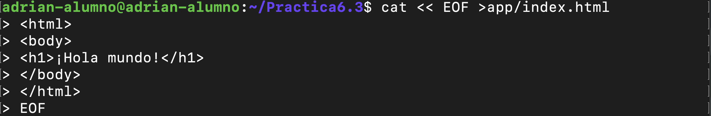

## 2.- Directorio conf:

Continuaremos creando un directorio conf donde tendremos almacenado nuestro fichero ldap_nginx.conf con el siguiente contenido:
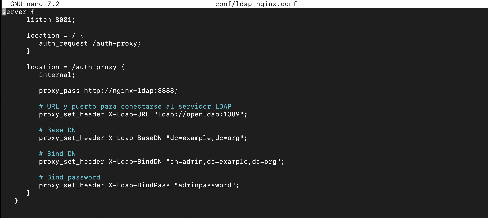

## 3.- Fichero docker-compose.yml:

Ahora, crearemos nuestro Dockerfile con la configuración necesaria para instalar todos los servicios necesarios para tener nuestro servidor web con usuarios autenticados mediante servicio de directorio (LDAP):
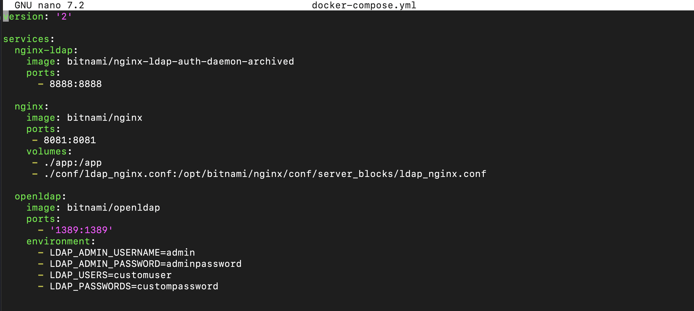

Y lo desplegaremos mediante el comando:
```docker-compose up -d```

## 4.- Comprobación de funcionamiento:

Ahora, comprobaremos que todo funciona correctamente. Para ello, iremos a nuestro navegador y escribiremos la dirección IP de nuestro servidor seguido del puerto 8081 o el que hayamos configurado en el fichero docker-compose.yml:
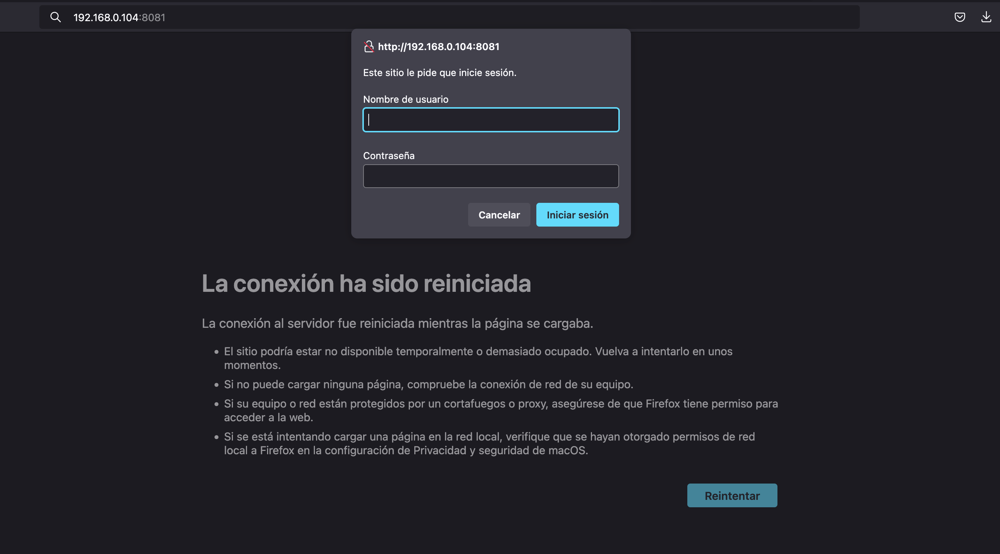

Y nos al loguearnos nos debería de aparecer la siguente pantalla:
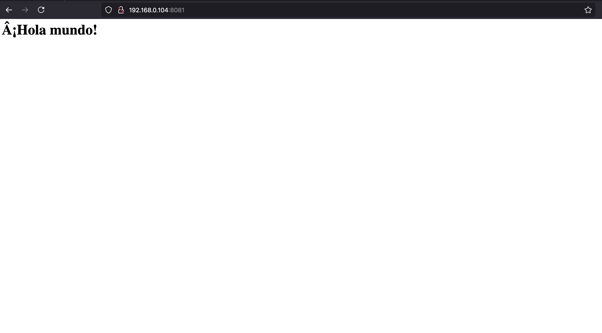

# Despliegue con Docker de PHP + Apache con autenticación LDAP

Ahora, continuaremos con la segunda parte de la practica que es el despliegue de php con Docker y un Apache con autenticación LDAP.

Antes de nada, nos tendremos que crear una carpeta llamada Docker, donde tendremos todos los archivos que vamos a configurar a continuación:

## 1.- Fichero index.php

Lo primero que deberemos de realizar es crearnos un fichero index.php con el siguiente contenido:
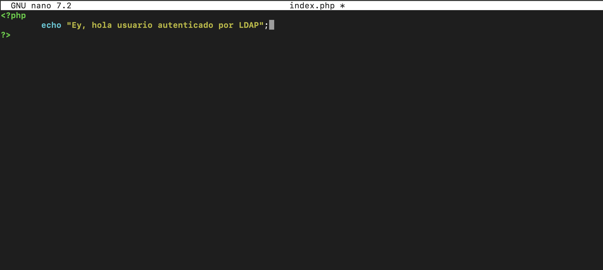

## 2.- Creación del fichero DockerFile

Ahora, continuaremos creando nuestro Dockerfile donde realizaremos las siguientes configuraciones:
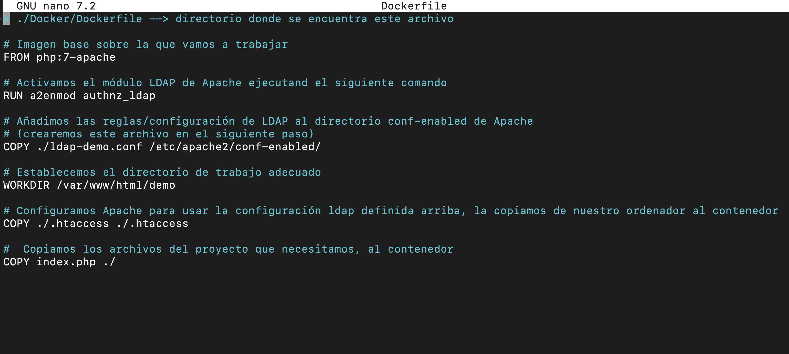

## 3.- Creación de fichero ldap-demo.conf

Continuamos creando el fichero ldap-demo.conf con el siguiente contenido:
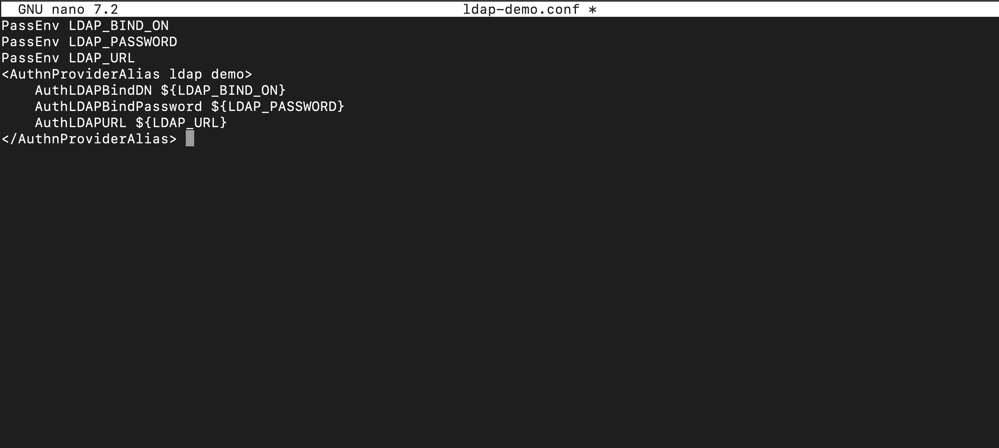

## 4.- Creación del fichero .htaccess

Y para finalizar, crearemos nuestro fichero .htaccess con el siguiente contenido:
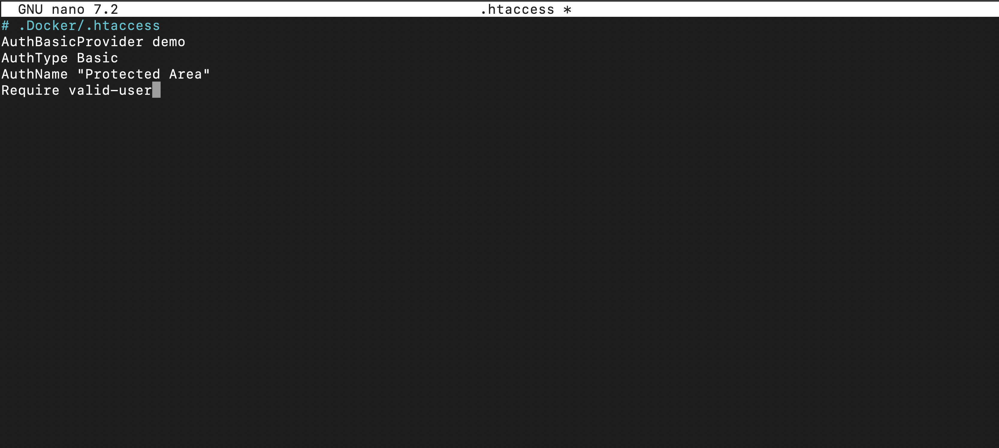


## 5.- Comprobación de funcionamiento

Para poder comprobar que todo ha ido bien, tendremos que construir nuestra imagen de docker mediante el comando ```docker build . -t docker_ldap -f Dockerfile```
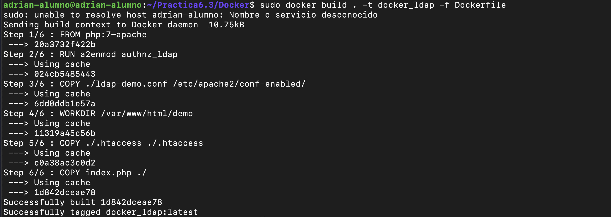

Una vez la hayamos contruido, deberemos de ejecutarla para ello, usaremos el siguiente comando:
```sudo docker run     -p 3000:80     --name nombre_que_le_quieras_dar_a_la_imagen     -e LDAP_BIND_ON='uid=admin,cn=users,cn=accounts,dc=demo1,dc=freeipa,dc=org'     -e LDAP_PASSWORD='Secret123'     -e LDAP_URL='LDAP://ipa.demo1.freeipa.org' docker_ldap```
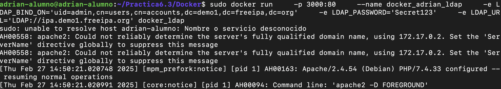

Y en nuestro navegador, buscaremos la direccion ip de nuestro servidor, seguido del puerto 3000 de la siguiente manera:
```ip_servidor:3000````

Y nos aparecerá una pantalla con el logueo de nuestro servidor donde deberemos de introducir el usuario y la contraseña que hemos configurado en nuestro servidor LDAP:
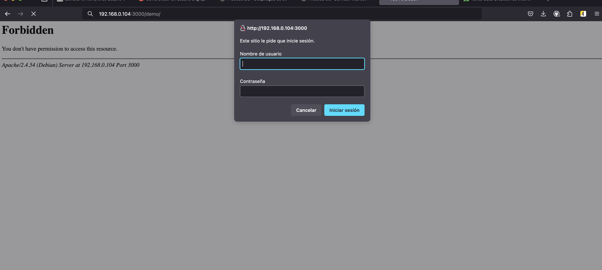

Una vez nos hayamos logueado, aparecerá la pantalla de nuestro index.php definido anteriormente:
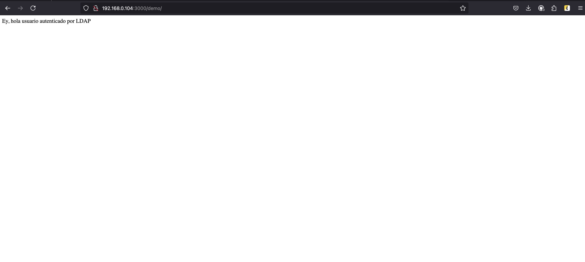