# Practica ampliación: Configuración de un servidor Nginx con Hosts Virtuales y directorios de usuario.
Para esta práctica, he clonado una de las máquinas de nginx anteriores que más limpia tenía y he comenzado con la configuración.

## Configuración de la máquina.
Para comenzar, lo primero que debemos de hacer es conectarnos por ssh a nuestro servidor desde nuestra máquina local.
Podemos hacer uso del comando ```ssh``` para conectarnos a nuestro servidor:
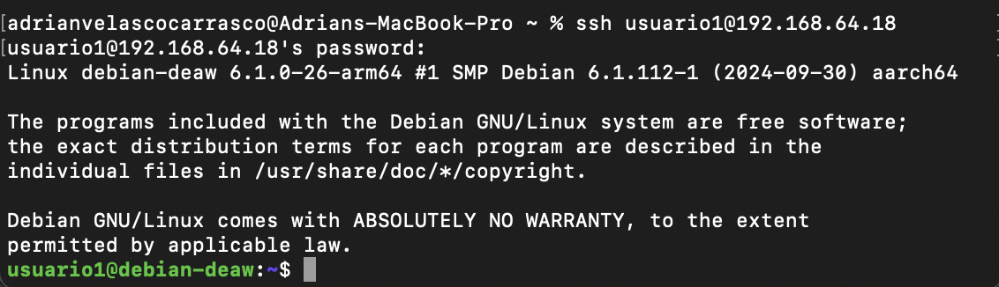

Cuando ya estemos conectados mediante ssh a nuestro servidor, crearemos nuestros usuarios necesarios para la practica.
Para ello, he hecho uso de los siguientes comandos:
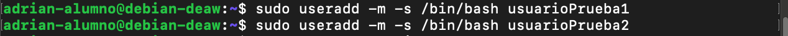

Pero con esto, aun no tendríamos creados correctamente nuestros usuarios ya que les tenemos que agregar una contraseña.
Para ello, usamos los siguientes comandos:
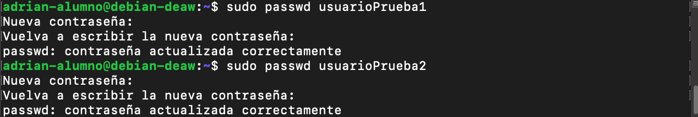

Ahora, una vez finalizada la creación de usuarios, procederemos a generas las carpetas que contendrán los archivos de los sitios web de cada usuario generado.

Lo primero que deberemos hacer desde nuestra terminal conectada mediante ssh es acceder a los usuarios generados mediante el uso de ```su nombreusuario```.

Una vez iniciada la sesión, desde la raíz del usuario, procederemos a crear una carpeta llamada ```public_html``` la cual contendrá los archivos del sitio web.

Y una vez creada, cambiaremos los permisos de la carpeta.
Para todo ello, hacemos uso de los siguientes comandos:

### Para usuarioPrueba1
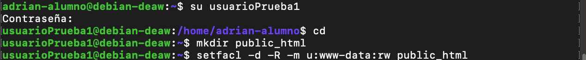

### Para usuarioPrueba2


Ahora, dentro de cada carpeta public_html, crearemos los archivos index.html correspondientes a cada usuario.
Para ello:

### Para usuarioPrueba1

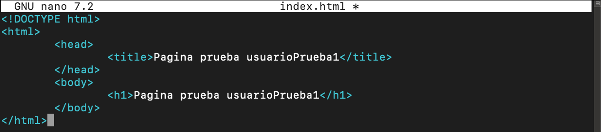

### Para usuarioPrueba2

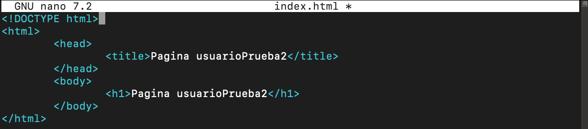

Una vez terminado los pasos anteriores, saldremos del usuario en el que nos encontremos y procederemos a trabajar, nuevamente, con nuestro servidor directamente.

Los siguientes pasos a seguir serán los siguientes:

## Generar un par de claves, una para cada usuario.
Para ello haremos uso del siguiente comando:

### Para usuarioPrueba1
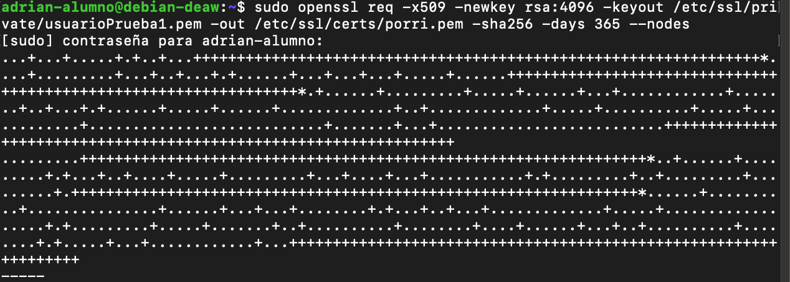

### Para usuarioPrueba2
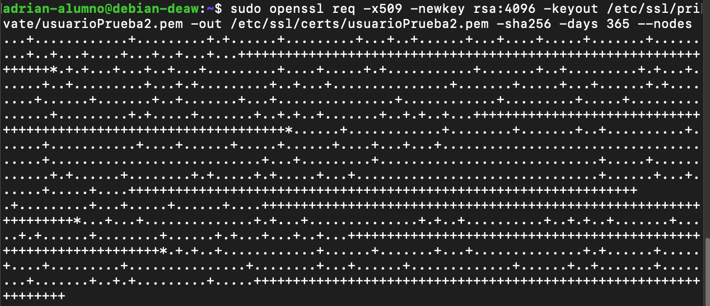

## Creación del espacio para cada uno de los sitios web de los usuarios.
Tendremos que crear en nuestro servidor nginx, en el apartado ```sites available``` el apartado para cada uno de los sitios de cada usuario.
Para ello haremos uso de los siguientes comandos:
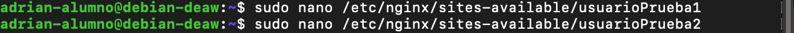

Una vez generados, debemos de agregar a cada uno de los sitios una configuración específica. 
Aquí tendríamos la configuración de cada uno de los usuarios:

## Para usuarioPrueba1
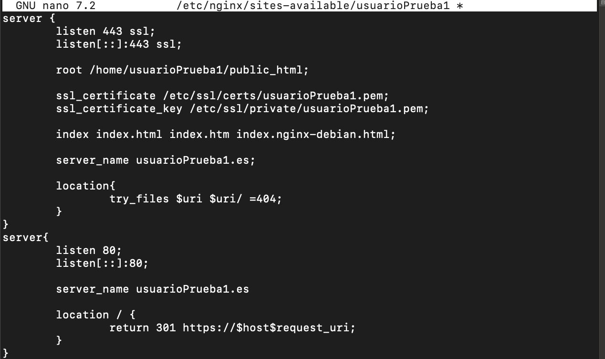

## Para usuarioPrueba2


Una vez generados los archivos de configuración, debemos de hacer el enlace simbólico entre este archivo y el directorio ```sites-enabled```. 
Para ello usaremos el siguiente comando:
## Para usuarioPrueba1
```sudo ln -s /etc/nginx/sites-available/usuarioPrueba1 /etc/nginx/sites-enabled```
## Para usuarioPrueba2
```sudo ln -s /etc/nginx/sites-available/usuarioPrueba2 /etc/nginx/sites-enabled```

Una vez realizado el enlace simbólico, reiniciaremos nuestro servicio de nginx y procederemos a ingresar a los dos sitios en el documento ```hosts``` de nuestra máquina local para hacer uso de estos.
Para ello:
```sudo nano /etc/hosts```
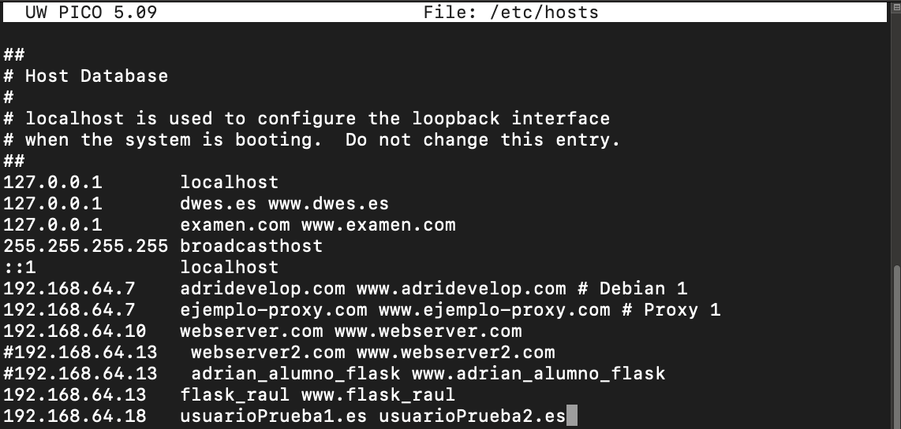

Con esto realizado y con nuestro servidor nginx sin errores, podremos acceder a los dos sitios web generados.
## Pruebas.

## Comprobación uso https con certificado autofirmado.
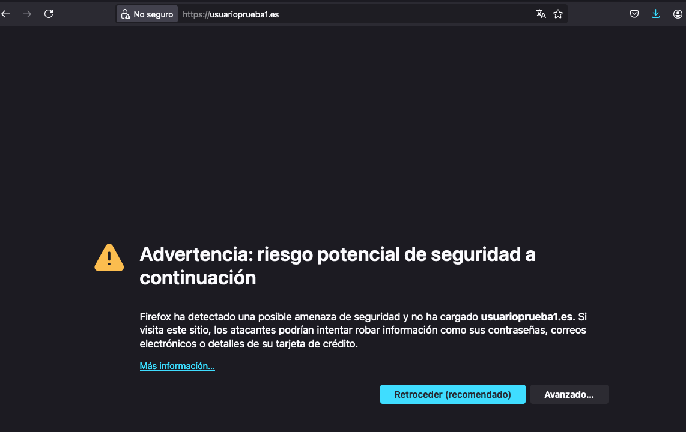
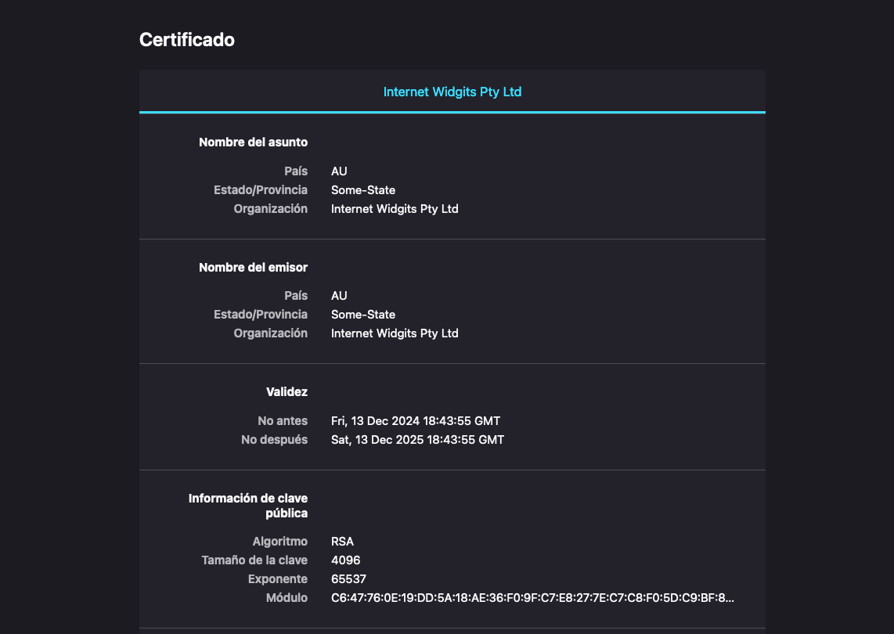
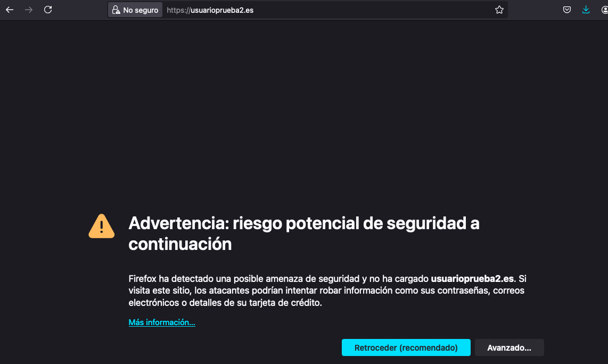

## Comprobación funcionalidad página.
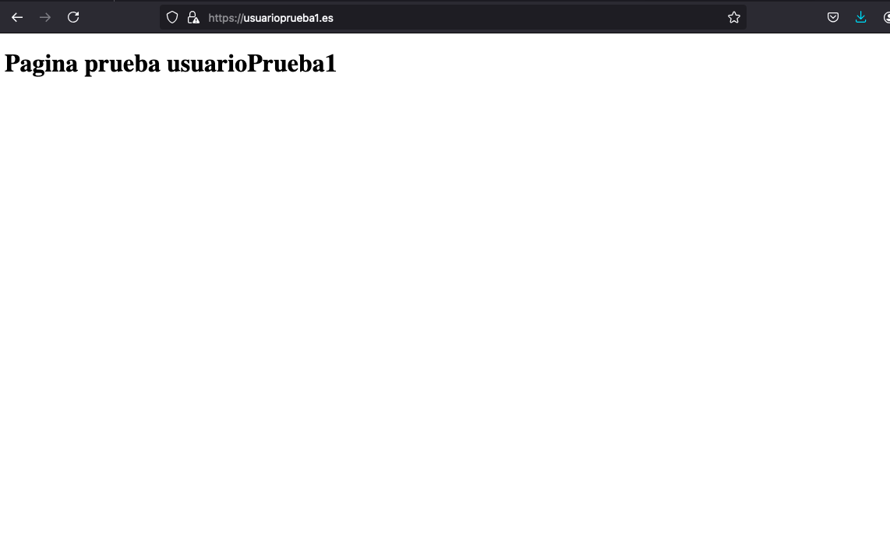
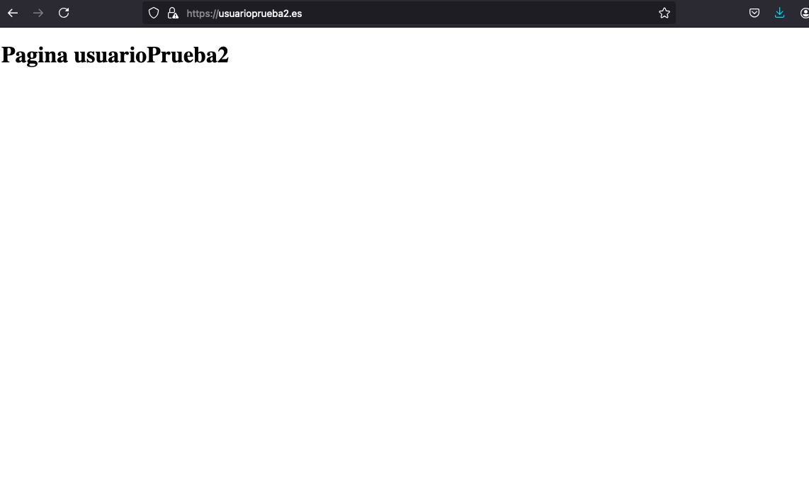