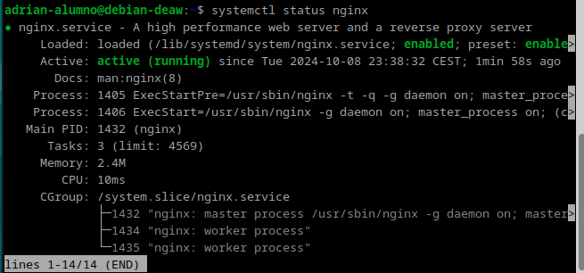
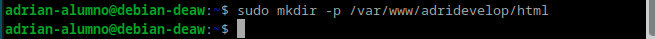
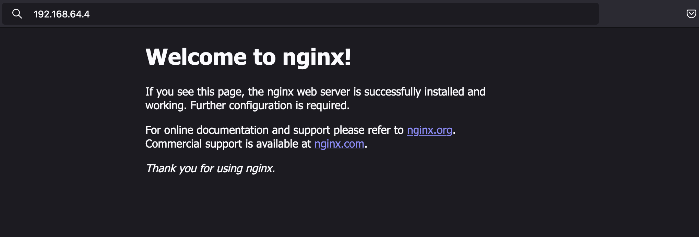
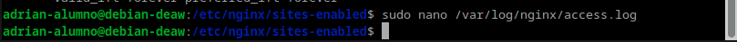
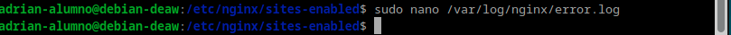
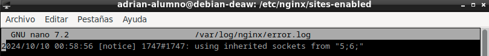
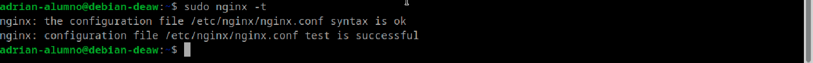
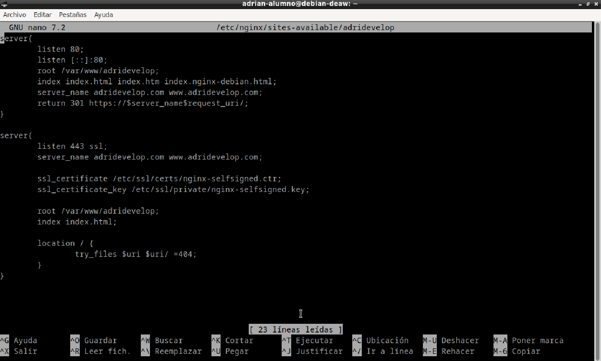

# Práctica 2.1 - Instalación y configuración de un servidor web Nginx

### Instalación

Para instalar el servidor de nginx en nuestra Debian debemos de realizar los siguientes comandos: <br>
`sudo apt update`
`sudo apt install nginx`


Y comprobamos que se ha instalado y que está funcionando correcamente: <br>
`systemctl status nginx`



### Creación de las carpetas del sitio web

Vamos a crear nuestra carpeta para nuestro sitio web dentro de /var/www ya que típicamente, estas carpetas almacenan los sitios.
Para crearla haremos uso del comando: `sudo mkdir -p /var/www/adridevelop/html`



Para el siguiente paso, deberemos de instalar git en Debian. Para ello realizamos lo siguiente.


Y dentro de esta carpeta, debemos clonar el repositorio: `https://github.com/cloudacademy/static-website-example`


Ahora, haremos que el usuario www-data sea el propietario mediante el comando `sudo chown -R www-data:www-data /var/www/adridevelop/html`.


A continuación, daremos los permisos necesarios para no tener errores en el acceso al sitio web usando el comando `sudo chmod -R 755 /var/www/adridevelop`


Y comprobaremos que está funcionando desde nuestra máquina local escribiendo en la barra de búsqueda la ip de nuestro servidor.



### Configuración de servidor web NGINX

Para que podamos presentar contenido en nuestra webm deberemos de crear un bloque de servidor con directivas correctas. Para ello, crearemos un nuevo archivo de configuración. Iremos a nuestra terminal y crearemos nuestro archivo de configuración mediante `sudo nano /etc/nginx/sites-available/vuestro_dominio`.


Y dentro de este archivo que hemos creado, generaremos lo siguiente:

```
server {
        listen 80;
        listen [::]:80;
        root /ruta/absoluta/archivo/index;
        index index.html index.htm index.nginx-debian.html;
        server_name nombre_web;
        location / {
                try_files $uri $uri/ =404;
        }
}
```


También, deberemos de crear un archivo simbólico entre este archivo y el de los sitios que están habilitados. Para ello `sudo ln -s /etc/nginx/sites-available/nombre_web /etc/nginx/sites-enabled/`


Y reiniciaremos el servidor. `sudo systemctl restart nginx`


### Comprobaciones

Para comprobar que nuestro host está funcionando, deberemos de acceder dentro de nuestra máquina cliente a /etc/host y añadiremos nuestro servidor nginx.


Y deberemos también comprobar que, las peticiones se están registrando correctamente en los archivos de logs, tanto las correctas como las erróneas.








### FTP

Para configurar SFTP en Debian deberemos de instalar antes vsftpd, para ello, haremos uso de `sudo apt-get install vsftpd`


Tras eso, crearemos una carpeta en nuestro home de Debian llamada ftp. `mkdir /home/adrian-alumno/ftp`


Tras eso, deberemos de crear los certificados de seguridad necesarios mediante `sudo openssl req -x509 -nodes -days 365 -newkey rsa:2048 -keyout /etc/ssl/private/vsftpd.pem -out /etc/ssl/private/vsftpd.pem`


Y una vez realizados estos pasos, deberemos de editar el documento /etc/vsftpd.conf de la siguiente manera: `sudo nano /etc/vsftpd.conf`


Y guardaremos los cambios y reiniciaremos el servidor. `sudo systemctl restart -now vsftpd`


Tras esta configuración, instalaremos FileZilla y haremos una operación ftp a nuestro servidor. Para ello, deberemos de poner nuestra ip, nombre de usuario, contraseña y puerto para que podamos realizar la conexión. 


Tras haber realizado la conexión correctamente, debemos pasar un archivo para comprobar que funciona, en mi caso, una foto.


### HTTPS 

Deberemos de instalar openssl para que podamos acceder a nuestro sitio a través de https.


Ahora, crearemos nuestro certificado.


Y tras eso, almacenaremos la configuración.



Y agregaremos el cerficado y las nuevas rutas a nuestro fichero.



Y en nuestro host, añadiremos en nuestra ip, las direcciones añadidas anteriormente.


Y buscamos en nuestro navegador nuestro sitio web.


